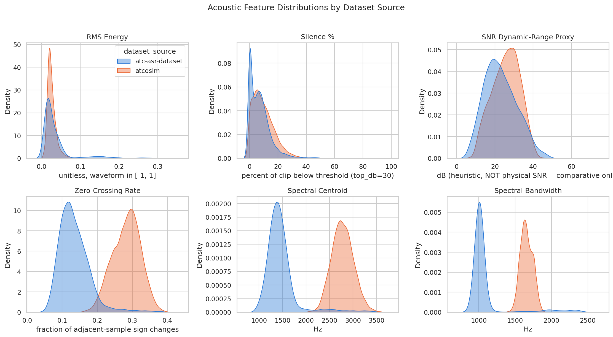
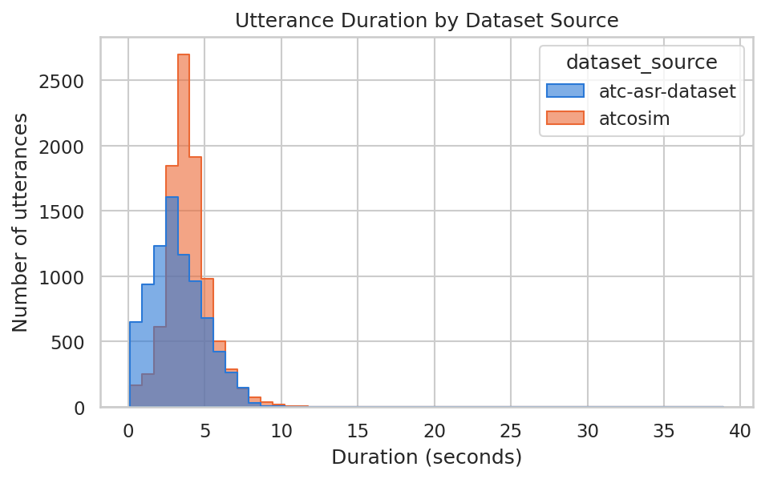
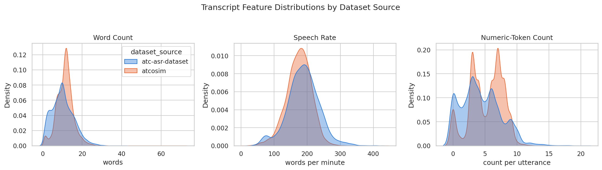
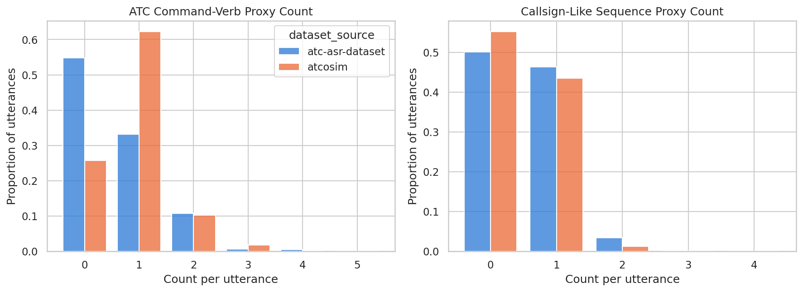
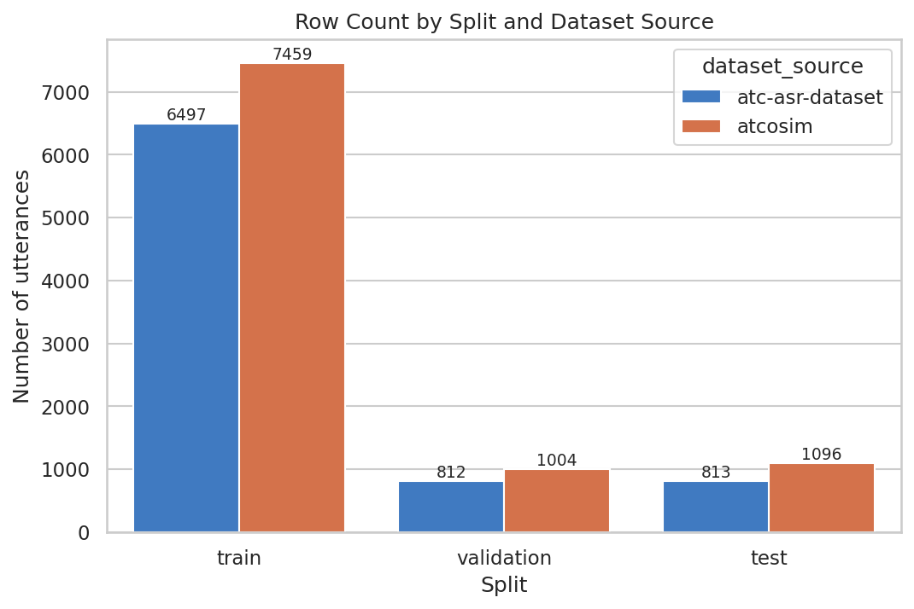

# ATC Communications Intelligence: Speech Recognition and Information Extraction for Aviation Safety

# 1. Title and Author

|  |  |
| --- | --- |
| **Author** | Brett Allen |
| **GitHub Repository** | https://github.com/BrettFX/UMBC-DATA606-Capstone |
| **LinkedIn** | https://linkedin.com/in/brett-allen-586ba4121 |
| **PowerPoint Presentation** | [Allen_DATA_606_Capstone_Proposal.pptx](./Allen_DATA_606_Capstone_Proposal.pptx) |
| **YouTube Channel** | https://www.youtube.com/@brettallen2199 |

---

# 2. Background

## 2.1 Topic Overview

Air traffic control (ATC) operations rely heavily on voice communication between air traffic controllers and pilots. These radio transmissions communicate operational information such as aircraft callsigns, altitude assignments, headings, speeds, runway instructions, and radio-frequency changes.

Unlike ordinary conversational speech, ATC communications use specialized aviation phrasing and frequently contain dense numeric and operational information. Radio communications may also be affected by background noise, interference, rapid speech, accents, varying audio quality, and overlapping or abbreviated phrasing.

This project investigates the application of modern Automatic Speech Recognition (ASR) and Natural Language Processing (NLP) techniques to ATC radio communications. The primary goal is to determine how effectively ATC audio can be converted into accurate text and then transformed into structured aviation information.

The project will follow a general communication-intelligence pipeline:

> **ATC Audio → Speech Recognition → Aviation Information Extraction → Communication Analysis**
> 

A prototype application (likely using `Streamlit`) is planned for development to be used to demonstrate the trained models and analytical results. The goal is to implement a real-world use case that Air Traffic Controllers and Pilots can use to enhance daily operations and promote aviation safety.

---

## 2.2 Why This Topic Matters

Clear and accurate communication is a fundamental component of aviation operations. ATC transmissions frequently contain operationally significant information including:

- Aircraft callsigns
- Altitude assignments
- Heading instructions
- Speed restrictions
- Runway information
- Radio frequencies
- Other controller instructions

Modern speech-recognition models can achieve strong performance on general speech, but ATC communications represent a specialized domain. For example, a model could produce a transcript that appears mostly correct but incorrectly recognizing an operationally important number, callsign, or command.

For instance, confusing an altitude of "five thousand" with "six thousand" may represent only a small number of incorrect words when measured using traditional transcription metrics, yet the error is considerably more meaningful in an aviation context.

This creates an opportunity to evaluate speech-recognition systems not only by overall transcription accuracy, but also by their ability to correctly recognize aviation-specific information.

NLP techniques may provide an additional layer of analysis by identifying structured operational entities from ATC transcripts via Named Entity Extraction (NER). Combining ASR and NLP could make it possible to transform unstructured aviation audio into structured data suitable for analysis and decision-support applications.

---

## 2.3 Research Questions

This project will investigate the following research questions.

### Research Question 1: Automatic Speech Recognition (ASR)

**How accurately can general-purpose and aviation-domain-adapted (pre-trained and/or fine-tuned) speech recognition models transcribe air traffic control communications?**

Potential evaluation measures include:

- Word Error Rate (WER)
- Character Error Rate
- Callsign recognition accuracy
- Numeric-value recognition accuracy
- Command recognition accuracy

---

### Research Question 2: Aviation Information Extraction

**Can NLP techniques reliably identify operational aviation information from ATC transcripts?**

> **NOTE:** The datasets explored so far do not provide token-level entity labels (e.g., callsign spans, command spans, etc.) inside a transcript. Therefore, training or evaluating extraction will require a rule-based/pattern approach (e.g., regex over standardized ATC phrasing) as well as an additional small (likely manually annotated) evaluation dataset, rather than full supervised training on existing labels. As an aside, there likely exists annotated datasets already but it may be possible to leverage the use of an LLM to help curate such a training dataset to then train a `spaCy` NER model to extract different information categories of interest.
> 

Potential information categories include:

- Callsigns
- Commands
- Altitudes
- Headings
- Speeds
- Runways
- Radio frequencies
- Other operational values

Potential evaluation measures include:

- Precision
- Recall
- F1 score
- Per-entity F1 score

---

### Research Question 3: Communication Characteristics and Model Performance

**What acoustic and linguistic characteristics of ATC transmissions are associated with speech-recognition performance?**

Not every transmission is equally difficult to transcribe, and this question is about *why*. **Acoustic characteristics** describe the audio signal itself, such as how long a transmission runs, how quickly someone speaks, and how noisy or clear the recording is. **Linguistic characteristics** describe the spoken content, such as how many words are packed into a transmission, and how much operationally dense information (e.g., callsigns, numbers, commands, etc.) it carries. If certain acoustic or linguistic profiles turn out to correlate with higher error rates, then it's something that can be addressed. It points to where a model is likely to fail, and suggests targeted responses (e.g., more training data for that condition, preprocessing to compensate for noise, flagging low-confidence transcripts for manual review, etc.).

**Core characteristics** (implemented in the comprehensive EDA and populated for every transmission; see [notebooks/comprehensive_eda.ipynb](../notebooks/comprehensive_eda.ipynb) and Section 4 below):

- Transmission duration (`duration_sec`)
- Word count (`word_count`) and character count (`character_count`)
- Speech rate (`speech_rate_wpm`)
- Recording origin (`dataset_source`): whether the audio was collected from live operational communications or a controlled/simulated environment, since collection method turned out to correlate strongly with acoustic bandwidth, vocabulary variety, and phraseology structure (see Section 4)
- Acoustic proxies: RMS energy, silence percentage, an SNR dynamic-range proxy (heuristic; see the caveat in Section 4), zero-crossing rate, spectral centroid, and spectral bandwidth
- Text proxies standing in for Research Question 2's not-yet-built extraction output: numeric-token count, ATC command-verb count, and callsign-like-sequence count, all lightweight vocabulary/regex proxies, not ground-truth entity labels

**Planned characteristics** (still not built): true aviation-entity counts from real named-entity extraction (the proxies above are a stand-in, not a substitute), and speaker role: neither current source dataset publishes a speaker-role field, so this remains N/A pending a labeled data source or a new annotation effort, not just an implementation gap.

Potential relationships to investigate include:

- Word Error Rate (WER) vs. transmission duration
- WER vs. speech rate
- WER vs. recording origin (real vs. simulated)
- WER vs. the SNR dynamic-range proxy; aviation-entity error rate vs. audio quality (still pending real entity labels for the second half)

---

# 3. Data

Two aviation speech datasets were acquired, joined, and inspected for this research. The full
data-ingestion pipeline (`src/preprocessing/`), data-quality checks, and exploratory analysis
are documented in [notebooks/comprehensive_eda.ipynb](../notebooks/comprehensive_eda.ipynb).

1. **ATC-ASR-Dataset** (real ATC communications)
2. **ATCOSIM** (simulated ATC communications)

After combining the two datasets and running data-quality checks, they provide **17,681
utterances** (13,956 train / 1,816 validation / 1,909 test) across roughly **17.9 hours** of
ATC audio. `DataIngestPipeline` (`src/preprocessing/ingest.py`) joins them, resamples all audio
to a common 16kHz sample rate, derives utterance-level acoustic and text features, and runs
auditable data-quality checks; see Section 4 for the full cleaning/feature-engineering
methodology and findings.

**A note on dataset selection.** The proposal-stage EDA used **ATCO2-ASR**
([`jlvdoorn/atco2-asr`](https://huggingface.co/datasets/jlvdoorn/atco2-asr), 559 utterances) as
the real-ATC-audio source. During the comprehensive EDA phase, a larger real-ATC alternative was
found (**ATC-ASR-Dataset**), but its dataset card revealed it's built in part from "the ATCO2
1-Hour Test Subset," the same public release `jlvdoorn/atco2-asr` wraps. Running both would have
risked duplicate/overlapping recordings across two "sources" that are really the same
underlying audio, and, worse, could have leaked the same utterance into both a training split
(via `atco2-asr`) and a test split (via `atc-asr-dataset`). ATCO2-ASR was therefore **replaced**
by ATC-ASR-Dataset rather than run alongside it: same real-ATC-audio role in the project, ~9x
more data (8,122 vs. 559 utterances), with its own train/validation/**test** split (ATCO2-ASR
only had train/validation). ATCO2-ASR's schema and structure remain documented in
[data_dictionary_atco2-asr.csv](data_dictionary_atco2-asr.csv) as a historical record of this
decision.

---

## 3.1 ATC-ASR-Dataset

### Data Source

**ATC ASR Dataset**

Source: https://huggingface.co/datasets/jacktol/ATC-ASR-Dataset

Per its dataset card, it is "a high-quality, fine-tuning-ready speech recognition dataset
constructed from two real-world Air Traffic Control (ATC) corpora: the UWB ATC Corpus and the
ATCO2 1-Hour Test Subset." Transcripts are cleanly segmented at the utterance level and
normalized by the publisher (uppercased, digits spelled out as words, letters expanded to the
ITU phonetic alphabet).

### Dataset Description

ATC-ASR-Dataset is a real air-traffic-control speech corpus combining the UWB ATC Corpus
(Czech-airspace ATC audio, heavily accented English) and the ATCO2 1-Hour Test Subset (diverse
ATC environments, speaker accents, and acoustic conditions). Because it's real, radio-transmitted
audio, it serves as the harder, higher-value evaluation target for this project; the acoustic
analysis in Section 4 shows it occupies a measurably different (narrower-bandwidth, more
variable-energy) region of acoustic feature space than the simulated ATCOSIM corpus.

---

### Data Size and Shape

| Characteristic | Value |
| --- | --- |
| Number of rows / utterances | 8,122 (6,497 train / 812 validation / 813 test) |
| Number of columns | 3 raw on Hugging Face (`id`, `audio`, `text`); 27 total after `DataIngestPipeline` (see Section 3.5) |
| Number of audio files | 8,122 |
| Duration | mean 3.28s per utterance, std 1.73s, range 0.33-15.27s (~7.4 hours total) |
| Audio format | WAV, mono |
| Sample rate | 16,000 Hz (native; matches this project's target rate) |

---

### Time Period

**Not applicable.** Row `id`s (e.g. `01d7425638602ab696a4`) are opaque hashes with no embedded
recording date/session information, unlike the retired ATCO2-ASR's filenames.

---

### Unit of Observation

**One ATC utterance**: a 16kHz mono audio clip and its ground-truth transcript, plus the
publisher's own opaque row `id`. No recording-level metadata (airport, position, waypoints) is
provided, a reduction in per-row context compared to the retired ATCO2-ASR dataset's `info`
field, traded for ~14.5x the utterance count.

---

### Data Dictionary

> **NOTE:** Generated directly from `utterance_df` (post data-quality-checks) via
> `schema.FINAL_UTTERANCE_COLUMNS` and exported to
> [data_dictionary_atc-asr-dataset.csv](data_dictionary_atc-asr-dataset.csv). "Observed Value" is
> each column's first non-null example among this source's rows. See Section 3.5 for the full
> column table (shared by both datasets after the join).

---

## 3.2 ATCOSIM Dataset

### Data Source

**ATCOSIM: Air Traffic Control Simulation Speech Corpus**

Source:

https://huggingface.co/datasets/Jzuluaga/atcosim_corpus

### Dataset Description

ATCOSIM is an aviation speech corpus containing simulated ATC communications produced by professional air traffic controllers.

The corpus contains speech recordings and corresponding transcripts and provides a much larger
source of aviation-domain audio which is useful for:

- ASR model training or fine-tuning
- ASR model evaluation on clean, uniformly-phrased speech
- Cross-dataset model comparison against real ATC-ASR-Dataset audio

Accessed via the Hugging Face mirror
[`jlvdoorn/atcosim`](https://huggingface.co/datasets/jlvdoorn/atcosim). ATCOSIM serves as the
primary training-volume dataset for this project (54.1% of combined utterances, 58.5% of
combined audio hours). However, the real-audio ATC-ASR-Dataset remains the evaluation target.

---

### Data Size and Shape

| Characteristic | Value |
| --- | --- |
| Size on disk | ~2.4 GB |
| Number of rows / utterances | 9,559 (7,459 train / 1,004 validation / 1,096 test, after this project's own session-grouped resplit; see Section 3.5) |
| Number of columns | 2 raw on Hugging Face (`audio`, `text`); 27 total after `DataIngestPipeline` (see Section 3.5) |
| Number of audio files | 9,559 |
| Total audio duration | ~10.46 hours (mean 3.94s per utterance, std 1.51s, range 0.14-38.88s) |
| Audio format | WAV, mono |
| Number of speakers | Not provided; `jlvdoorn/atcosim` has no speaker-identifier column, though filenames encode a `<speaker>_<session>` prefix used for leakage-safe splitting (Section 3.5) |

---

### Time Period

**Not applicable.** No recording dates are provided, and filenames (e.g., `gf1_01_001.wav`) use
a generic recording/session naming convention with no embedded date, unlike the retired
ATCO2-ASR's.

---

### Unit of Observation

**One simulated ATC utterance**: a 32kHz mono audio clip (resampled to 16kHz by
the `DataIngestPipeline`) and its ground-truth transcript. No recording-level metadata is provided beyond the audio and transcript, and the filename's `<speaker>_<session>` prefix.

---

### Data Dictionary

> **NOTE:** Generated directly from `utterance_df` (post data-quality-checks) via
> `schema.FINAL_UTTERANCE_COLUMNS` and exported to
> [data_dictionary_atcosim.csv](data_dictionary_atcosim.csv). "Observed Value" is each column's
> first non-null example among this source's rows. See Section 3.5 for the full column table
> (shared by both datasets after the join).

---

## 3.3 Target Variables / Labels

Because the project contains more than one machine-learning task, there may not be a single target variable for the entire project.

### Automatic Speech Recognition

For the ASR task, the primary target will be:

**`transcript`**

The model will receive an audio signal as input and attempt to predict the corresponding transcript.

---

### Aviation Information Extraction

As stated in previous sections, neither dataset provides ready-made entity annotations. Thus, the target labels will be derived rather than taken directly from the source data. For instance, an initial rule-based/pattern pass over transcripts, refined against a small manually annotated evaluation subset (e.g., via LLM or an additional data source found elsewhere).

The comprehensive EDA phase implemented a small step in this direction: `numeric_token_count`,
`command_verb_count`, and `callsign_like_count` (Section 4) are lightweight vocabulary/regex
proxies, useful for comparative EDA but explicitly not ground-truth entity labels. The planned
approach for real extraction is an LLM-based pass (Qwen3.5 Instruct) grounded by a curated
aviation-terms dictionary (term/acronym, definition, and example usage, e.g. airport codes,
phraseology terms, equipment/procedure acronyms), used both as an initial gazetteer for
candidate entity spans and as context the LLM can use to disambiguate an acronym with more
than one meaning from the surrounding utterance, avoiding the need to train a dedicated
sequence-labeling model (e.g. a fine-tuned BERT-style NER model) for this project's scope. This
is not yet implemented; it's documented here as the intended next step once the core ASR work
is complete.

Potential target labels include:

- Callsign
- Command
- Altitude
- Heading
- Speed
- Runway
- Frequency
- Other operational values

---

## 3.4 Candidate Features / Predictors

Different model tasks will require different predictors.

### ASR Model Inputs

The primary predictor for speech recognition will be the:

- Raw audio waveform

Potential derived audio representations or features may include:

- Mel-frequency spectrogram
- Mel-Frequency Cepstral Coefficients (MFCCs)
- Signal-to-Noise Ratio
- Root Mean Square (RMS) energy
- Spectral characteristics
- Silence percentage

> **NOTE:** For pre-trained transformer-based speech models, the raw or appropriately pre-processed waveform may be used directly rather than manually engineered features.
> 

---

### Information-Extraction Model Inputs

Potential predictors include:

- Transcript tokens
- Word sequence
- Context surrounding each token
- Aviation phrasing patterns
- Numeric expressions

Transformer-based NLP models or `spaCy` models may generate learned contextual representations directly from transcript text.

---

### Model-Performance Analysis Features

Matches Research Question 3's core/planned split above:

- **Core (implemented):** transmission duration, word count, character count, speech rate,
  dataset source, RMS energy, silence percentage, an SNR dynamic-range proxy, zero-crossing
  rate, spectral centroid/bandwidth, and the numeric-token/command-verb/callsign-like proxy
  counts (all documented with formulas and caveats in Section 4)
- **Planned (not yet implemented):** true aviation-entity counts from real named-entity
  extraction (see Section 3.3's LLM+dictionary plan), and speaker role (no source publishes
  this field, so it remains N/A rather than merely unbuilt)

These variables can be compared with model performance measurements such as WER to investigate which communication characteristics are associated with higher or lower transcription accuracy.

---

## 3.5 Dataset Integration

The two datasets are preserved separately through ingestion (`_load`, `_standardize_schema`) so
each source's original structure and metadata stays intact, then:

1. **Re-split for leakage safety (`_resplit`).** ATCOSIM's filenames encode a recording session
   (`<speaker>_<session>_<utterance>.wav`); utterances from the same session share a speaker,
   microphone, and simulation scenario, so a naive random split could put two utterances from
   the same session in both train and test. ATCOSIM is re-split into a fresh, session-grouped
   train/validation/test partition so no session straddles a split boundary. ATC-ASR-Dataset's
   published split is kept as-is: its row ids are opaque hashes with no recoverable session
   key, so a blind reshuffle there couldn't be verified leakage-safe, and its published split is
   already ~80/10/10 and publisher-curated.
2. **Join (`_join`, `concatenate_datasets`).** Splits are unioned (not intersected) across
   sources, so a split only one source publishes (originally, ATC-ASR-Dataset's `test`) isn't
   silently dropped for the other.
3. **Feature derivation (`_add_utterance_metadata`).** Every acoustic feature (Section 4) is
   computed inline during the same batched audio-decode pass that already derives
   `duration_sec`, so no clip is decoded twice. A per-row `try`/`except` around this step
   records `audio_decode_error` rather than letting one corrupt file crash the whole pipeline;
   `DataIngestPipeline.max_corrupt_fraction` raises if too many rows fail, catching a systemic
   problem (e.g. wrong cache dir) rather than quietly proceeding.
4. **Data-quality checks (`quality.run_quality_checks`).** Missing audio/transcript,
   zero-duration, corrupt-audio, and true-duplicate rows are dropped, each logged with a reason
   in an auditable cleaning log; repeated (but not duplicate) transcripts are flagged and
   retained; see Section 4 for why duplicate audio and repeated phrasing are treated
   differently, and the actual counts found.

The `DataIngestPipeline` produces a standardized utterance-level analytical table
(`utterance_df`, 17,681 rows, saved to `data/processed/utterances.parquet`) with the following
structure (the canonical version of this table is `preprocessing.schema.FINAL_UTTERANCE_COLUMNS`,
kept in code so this documentation can't silently drift from what the pipeline actually
produces; `schema.validate_final_schema` asserts they match on every run):

| Column | Description |
| --- | --- |
| `utterance_id` | Reproducible id assigned by DataIngestPipeline: '<dataset_source>-<original_split>-<row index>'. |
| `dataset_source` | Which corpus this row came from: 'atcosim' or 'atc-asr-dataset'. |
| `original_split` | The split as originally published by the source, before this project's own resplit. |
| `dataset_split` | This project's own train/validation/test split (see DataIngestPipeline._resplit). |
| `source_id` | The publisher's own row id, where available (atc-asr-dataset only; null for atcosim). Not used for joins/dedup -- `utterance_id`/`audio_checksum` are canonical for that. |
| `audio_path` | Original filename of the row's audio clip. |
| `audio_checksum` | sha1 of the decoded waveform's bytes; canonical audio-identity key for dedup. |
| `audio_decode_error` | None if the row's audio decoded cleanly; the exception message otherwise. |
| `transcript` | Raw transcript text as published by the source. |
| `transcript_normalized` | Lowercased, whitespace/punctuation-normalized transcript; canonical text-identity key for dedup. |
| `duration_sec` | Audio duration in seconds, from the decoded waveform. |
| `sample_rate` | Audio sample rate in Hz after resampling (see DataIngestPipeline.target_sample_rate); 0 for a corrupt row. |
| `word_count` | Whitespace-delimited token count of `transcript`. |
| `character_count` | Character count of `transcript`. |
| `speech_rate_wpm` | word_count / (duration_sec / 60); NaN if duration_sec is non-positive. |
| `numeric_token_count` | Count of ATC numeral-word tokens in `transcript_normalized` (see preprocessing.vocab). |
| `command_verb_count` | Count of ATC command-verb tokens in `transcript_normalized`; a proxy pending real NER (deferred). |
| `callsign_like_count` | Count of callsign-like token runs in `transcript_normalized`; a proxy pending real NER (deferred). |
| `rms_energy` | Mean per-frame RMS amplitude (unitless, waveform in [-1, 1]); loudness proxy. |
| `silence_pct` | Percent of the clip librosa.effects.split(top_db=30) marks as below-threshold. |
| `snr_db_proxy` | P95-P10 gap of per-frame RMS-in-dB; a heuristic dynamic-range proxy, NOT a physical SNR measurement -- comparative use only. |
| `zero_crossing_rate` | Mean per-frame zero-crossing rate; noisiness/unvoiced-speech proxy. |
| `spectral_centroid_hz` | Mean per-frame amplitude-weighted mean frequency (Hz); 'brightness'. |
| `spectral_bandwidth_hz` | Mean per-frame amplitude-weighted frequency spread (Hz). |
| `recorded_at` | ISO-8601 recording timestamp parsed from the filename, where the source's filenames embed one; null otherwise (structural, not missing data -- see DataIngestPipeline._parse_recorded_at). |
| `is_repeated_transcript` | True if `transcript_normalized` recurs across 2+ rows with *different* audio content (expected fixed ATC phraseology; never dropped -- see preprocessing.quality). |
| `repeated_transcript_count` | How many rows (post-cleaning) share this row's `transcript_normalized`. |

> **NOTE:** `speaker_role`, real `callsign_count`/`command_count`/`entity_count` (from ground-truth
> NER, as opposed to the proxy columns above) are not yet included; see Section 3.3's deferred
> extraction plan. The `DataIngestPipeline` will likely continue to evolve through later
> iterations of this project (e.g. additional pipeline scripts for model training/evaluation/
> inference) so the same ingestion logic isn't duplicated.

---

# 4. Exploratory Data Analysis

The full, cell-by-cell EDA (every table and figure below, plus the code that produced them)
is in [notebooks/comprehensive_eda.ipynb](../notebooks/comprehensive_eda.ipynb), which runs
cleanly top to bottom. This section summarizes the methodology and the findings that matter
most for the project's research questions; only figures that support a specific stated finding
are included here (the notebook itself is the complete record).

## 4.1 Data Cleansing and Preparation

The corpus started as 17,681 raw rows across both sources (9,559 ATCOSIM + 8,122
ATC-ASR-Dataset) after joining. `preprocessing.quality.run_quality_checks` then ran six ordered
checks: missing audio, missing transcript, non-positive duration, corrupt audio (all drop the
row if triggered), true-duplicate rows (drop), and repeated transcripts (flag only, never
drop), logging every stage's `rows_in`/`rows_flagged`/`rows_removed`/`rows_out` to an auditable
cleaning log rather than silently mutating the data. **Result: 0 rows were dropped by any check
in this corpus**: no corrupt audio, no missing transcripts, no non-positive durations, and no
true accidental duplicates (every one of the 17,681 rows has a unique `audio_checksum`). The
final analytical dataset is the full 17,681 rows, saved to `data/processed/utterances.parquet`.

**Duplicates required a two-way split, not a single rule.** A duplicate *recording* (same
`audio_checksum` **and** the same normalized transcript) is an accidental data-quality issue and
is dropped. A duplicate *transcript alone* (same wording, different audio) is expected (ATC
uses fixed phraseology, so many distinct recordings legitimately share wording), and is
retained, flagged via `is_repeated_transcript`. **20.9% of rows carry a repeated transcript
overall, but the rate is very different by source: 31.6% for ATCOSIM vs. 8.2% for
ATC-ASR-Dataset**, consistent with ATCOSIM's simulated exercises drawing from a smaller,
more-scripted set of scenarios than naturalistic real-world traffic. The most-repeated
transcripts are short acknowledgements ("roger" ×107, "thank you" ×58, "affirm" ×48, "standby"
×28) and one recurring scripted exchange ("contact milan one three four five two good bye" ×15),
exactly the kind of fixed phraseology this rule is designed to preserve rather than discard.

**Missingness is entirely structural**, not a data-quality gap: `recorded_at` is null for 100%
of rows in both sources (neither `atcosim`'s nor ATC-ASR-Dataset's filenames embed a recording
timestamp; only the retired ATCO2-ASR's did), and `source_id` is null for 100% of `atcosim`
rows (its Hugging Face mirror simply doesn't provide a row id). Neither is used for anything
load-bearing; `utterance_id`/`audio_checksum` are this project's canonical identity keys and are
100% populated.

## 4.2 Acoustic Feature Analysis

Six acoustic features (RMS energy, silence percentage, an SNR dynamic-range proxy,
zero-crossing rate, spectral centroid, spectral bandwidth; formulas, units, and assumptions
documented in `preprocessing/audio_features.py`) were computed per utterance directly from the
decoded waveform, inline in the same pass that derives `duration_sec`, so no clip is decoded
twice.

**Finding: real ATC audio (ATC-ASR-Dataset) occupies a measurably narrower-bandwidth region of
acoustic feature space than simulated ATCOSIM audio.** Mean spectral centroid is 1,460 Hz for
ATC-ASR-Dataset vs. 2,777 Hz for ATCOSIM; spectral bandwidth is 1,087 Hz vs. 1,657 Hz;
zero-crossing rate is 0.135 vs. 0.283: all three consistently lower for the real-audio source.
This lines up with how each corpus was produced: real ATC audio is transmitted over a narrowband
VHF radio channel (traditionally ~300-3,400 Hz voice bandwidth), which filters out exactly the
higher-frequency content these three features measure, while ATCOSIM's recordings are captured
full-bandwidth in a studio/lab setting with no radio-channel effect. ATC-ASR-Dataset also shows
higher RMS-energy variance (std 0.045 vs. 0.011), consistent with uncontrolled real-world
recording conditions (variable mic gain/distance, radio squelch) that a simulated corpus
wouldn't have.

**Modeling implication:** a model trained predominantly on ATCOSIM's clean, full-bandwidth audio
is learning a measurably different acoustic distribution than it will encounter in real
deployment; this is exactly the kind of domain gap the real-vs-simulated comparison in this
project is designed to surface before training begins.

ATCOSIM clips run slightly longer on average (3.94s vs. 3.28s) with a much heavier tail: its
maximum (38.9s) is over 2x ATC-ASR-Dataset's (15.3s). That outlier turned out to be an off-domain
personal conversation captured during a simulation session, not ATC phraseology at all (see
4.4). Both distributions are unimodal and right-skewed, as expected for short spoken utterances.

## 4.3 Transcript Feature Analysis

**Finding: ATCOSIM utterances are slightly longer by word count but draw from a much smaller,
more repetitive vocabulary.** ATCOSIM averages 11.3 words/utterance vs. 10.2 for
ATC-ASR-Dataset, but ATC-ASR-Dataset has a far richer vocabulary: 1,167 distinct word types vs.
830 for ATCOSIM, a type-token ratio of 0.0141 vs. 0.0077 (nearly double), despite ATCOSIM having
more total word tokens overall (107,913 vs. 82,764, from its larger row count). This is the same
pattern found in the repeated-transcript analysis (4.1): real-world ATC traffic is lexically
more varied than scripted simulation exercises, even under standardized phraseology conventions.

ATC-ASR-Dataset also shows a *higher* mean speech rate (187.7 vs. 174.4 WPM) despite shorter
average clips, plausibly real operational time pressure (controllers packing information
tightly) vs. more deliberately-paced simulated training speech. Both distributions have a long
right tail of very-high-WPM outliers, which turned out to be a known artifact of the WPM formula
on very short clips rather than genuinely fast speech (4.4).

**These are heuristic proxies, not ground-truth entity annotations** (Section 3.3). ATCOSIM has
a much higher command-verb detection rate (only 25.7% of its rows have zero detected command
verbs, vs. 54.8% for ATC-ASR-Dataset), again consistent with ATCOSIM's scripted scenarios
emphasizing standard instruction phraseology more systematically, while real traffic includes
more short acknowledgements and readbacks with no command verb present. Callsign-like detection
is more similar between sources (~50% vs. ~55% zero-detection); this proxy's fixed,
non-exhaustive airline-word vocabulary is the likely limiting factor for both sources equally,
exactly the gap the planned LLM-based extraction (Section 3.3) is meant to close.

## 4.4 Outliers

Three outlier patterns were investigated, each with an explicit retain/remove decision rather
than a blanket rule:

- **The 38.9-second ATCOSIM outlier** is genuine, correctly-transcribed audio of an off-domain
  personal conversation ("...have a nice evening, thank you bye bye ciao... the irish pub..."),
  not operational ATC phraseology. **Decision: retain in the EDA corpus** (it's legitimate data,
  not corrupt), **but flag as a candidate to exclude specifically from ASR training/eval
  splits**, since it isn't representative of the task the model is meant to learn.
- **Extreme speech-rate outliers (400+ WPM)** all come from 1-2 word, sub-second clips: a known
  mathematical artifact of `speech_rate_wpm = word_count / (duration_sec / 60)` on very small
  denominators, not genuinely fast speech. **Decision: retain the rows**, but treat
  `speech_rate_wpm` as unreliable below ~1 second of audio in any downstream use.
- **Very short single-word utterances** (~0.14-0.28s: "yeah", "roger", "okay") are genuine,
  expected ATC acknowledgements. One transcript, `"roge"`, is very likely a publisher-side
  transcription typo for "roger" (present in ATCOSIM's original data, not introduced by this
  pipeline), noted here as a known source imperfection rather than silently corrected.

## 4.5 Class Imbalance and Split Composition

The two sources are reasonably balanced within every split (ATC-ASR-Dataset is 42.6-46.6% of
each split's rows, ATCOSIM the remainder), so no split is dominated so heavily by one source
that a model could ignore the other. The overall split proportions (78.9%/10.3%/10.8%
train/validation/test) land close to, but not exactly, 80/10/10: ATC-ASR-Dataset is left at its
own near-exact 80/10/10 published split, while ATCOSIM's session-grouped resplit (Section 3.5)
overshoots slightly, since its ~50 recording sessions can't be divided into exactly-proportioned
groups. This is a disclosed, intentional trade-off (exact percentages traded for a test set
with zero same-session leakage), not a defect.

## 4.6 Summary of Findings and Modeling Implications

Every analysis in this section converges on the same underlying signal, approached from four
independent angles that all agree:

1. **Acoustics:** real audio has lower spectral centroid/bandwidth/zero-crossing rate (narrower,
   radio-filtered bandwidth) and higher RMS-energy variance (uncontrolled recording conditions)
   than simulated audio.
2. **Vocabulary:** real audio has nearly 2x the type-token ratio of simulated audio.
3. **Phraseology structure:** simulated audio has a much higher rate of detected command verbs
   and repeated transcripts: its scripted scenarios lean on a smaller, more standardized set of
   instructions.
4. **Speech rate:** real audio is spoken faster on average despite shorter clips.

**This is the central modeling implication of the comprehensive EDA:** a model trained
predominantly on ATCOSIM will see a narrower acoustic distribution and less varied vocabulary
than it will encounter in real deployment. Any evaluation strategy for this project should
report performance on the real-audio (ATC-ASR-Dataset) test split separately from
simulated-audio performance, not just an aggregate; aggregating them would hide exactly the
domain gap this EDA exists to surface. Two concrete, actionable follow-ups also came out of this
analysis: exclude the identified off-domain outlier (4.4) from training/eval splits, and treat
`speech_rate_wpm` as unreliable below ~1 second of audio wherever it's used as a feature.

---

# References

ATCO2 Project. (n.d.). *ATCO2: Automatic collection and processing of voice data from air-traffic communications*. https://www.atco2.org/

Hofbauer, K., Petrik, S., & Hering, H. (2008). The ATCOSIM corpus of non-prompted clean air traffic control speech. In *Proceedings of the Sixth International Conference on Language Resources and Evaluation (LREC'08)*. European Language Resources Association.

jacktol. (n.d.). *ATC-ASR-Dataset* [Data set]. Hugging Face. https://huggingface.co/datasets/jacktol/ATC-ASR-Dataset

jlvdoorn. (n.d.). *atco2-asr* [Data set]. Hugging Face. https://huggingface.co/datasets/jlvdoorn/atco2-asr

jlvdoorn. (n.d.). *atcosim* [Data set]. Hugging Face. https://huggingface.co/datasets/jlvdoorn/atcosim

Lhoest, Q., Villanova del Moral, A., Jernite, Y., Thakur, A., von Platen, P., Patil, S., Chaumond, J., Drame, M., Plu, J., Tunstall, L., Davison, J., Šaško, M., Chhablani, G., Malik, B., Brandeis, S., Le Scao, T., Sanh, V., Xu, C., Patry, N., … Wolf, T. (2021). *Datasets: A community library for natural language processing* (arXiv:2109.02902). arXiv. https://arxiv.org/abs/2109.02902

McFee, B., Raffel, C., Liang, D., Ellis, D. P. W., McVicar, M., Battenberg, E., & Nieto, O. (2015). librosa: Audio and music signal analysis in Python. In K. Huff & J. Bergstra (Eds.), *Proceedings of the 14th Python in Science Conference* (pp. 18–24).

University of West Bohemia. (n.d.). *UWB ATC Corpus* [Data set]. LINDAT/CLARIAH-CZ Repository. https://lindat.mff.cuni.cz/repository/xmlui/handle/11858/00-097C-0000-0001-CCA1-0
