# ATC Communications Intelligence: Speech Recognition and Information Extraction for Aviation Safety

# 1. Title and Author

|  |  |
| --- | --- |
| **Author** | Brett Allen |
| **GitHub Repository** | https://github.com/BrettFX/UMBC-DATA606-Capstone |
| **LinkedIn** | https://linkedin.com/in/brett-allen-586ba4121 |
| **PowerPoint Presentation** | [Allen_DATA_606_Capstone_Proposal.pptx](./Allen_DATA_606_Capstone_Proposal.pptx) |
| **YouTube Channel** | https://www.youtube.com/@brettallen2199 |

---

# 2. Background

## 2.1 Topic Overview

Air traffic control (ATC) operations rely heavily on voice communication between air traffic controllers and pilots. These radio transmissions communicate operational information such as aircraft callsigns, altitude assignments, headings, speeds, runway instructions, and radio-frequency changes.

Unlike ordinary conversational speech, ATC communications use specialized aviation phrasing and frequently contain dense numeric and operational information. Radio communications may also be affected by background noise, interference, rapid speech, accents, varying audio quality, and overlapping or abbreviated phrasing.

This project investigates the application of modern Automatic Speech Recognition (ASR) and Natural Language Processing (NLP) techniques to ATC radio communications. The primary goal is to determine how effectively ATC audio can be converted into accurate text and then transformed into structured aviation information.

The project will follow a general communication-intelligence pipeline:

> **ATC Audio → Speech Recognition → Aviation Information Extraction → Communication Analysis**

A prototype application (likely using `Streamlit`) is planned for development to be used to demonstrate the trained models and analytical results. The goal is to implement a real-world use case that Air Traffic Controllers and Pilots can use to enhance daily operations and promote aviation safety.

---

## 2.2 Why This Topic Matters

Clear and accurate communication is a fundamental component of aviation operations. ATC transmissions frequently contain operationally significant information including:

- Aircraft callsigns
- Altitude assignments
- Heading instructions
- Speed restrictions
- Runway information
- Radio frequencies
- Other controller instructions

Modern speech-recognition models can achieve strong performance on general speech, but ATC communications represent a specialized domain. For example, a model could produce a transcript that appears mostly correct but incorrectly recognizing an operationally important number, callsign, or command.

For instance, confusing an altitude of "five thousand" with "six thousand" may represent only a small number of incorrect words when measured using traditional transcription metrics, but the error is considerably more meaningful in an aviation context.

This creates an opportunity to evaluate speech-recognition systems not only by overall transcription accuracy, but also by their ability to correctly recognize aviation-specific information.

NLP techniques may provide an additional layer of analysis by identifying structured operational entities from ATC transcripts via Named Entity Extraction (NER). Combining ASR and NLP could make it possible to transform unstructured aviation audio into structured data suitable for analysis and decision-support applications.

---

## 2.3 Research Questions

This project will investigate the following research questions.

### Research Question 1: Automatic Speech Recognition (ASR)

**How accurately can general-purpose and aviation-domain-adapted (pre-trained and/or fine-tuned) speech recognition models transcribe air traffic control communications?**

Potential evaluation measures include:

- Word Error Rate (WER)
- Character Error Rate
- Callsign recognition accuracy
- Numeric-value recognition accuracy
- Command recognition accuracy

---

### Research Question 2: Aviation Information Extraction

**Can NLP techniques reliably identify operational aviation information from ATC transcripts?**

> **NOTE:** The datasets do not provide token-level entity labels (callsign spans, command spans, etc.). Instead of training on existing labels, this project used an LLM to curate a labeled dataset, built small human-verified evaluation sets (gold, silver and a frozen held-out set), and trained a `spaCy` NER model on the curated labels (implemented in Sections 5.9 and 5.10; held-out span F1 0.861-0.878 depending on model). The nine implemented categories are callsign, command, facility, altitude, heading, frequency, waypoint, runway and squawk code.

Potential information categories include:

- Callsigns
- Commands
- Altitudes
- Headings
- Speeds
- Runways
- Radio frequencies
- Other operational values

Potential evaluation measures include:

- Precision
- Recall
- F1 score
- Per-entity F1 score

---

### Research Question 3: Communication Characteristics and Model Performance

**What acoustic and linguistic characteristics of ATC transmissions are associated with speech-recognition performance?**

Not every transmission is equally difficult to transcribe, and this question is about *why*. **Acoustic characteristics** describe the audio signal itself, such as how long a transmission runs, how quickly someone speaks, and how noisy or clear the recording is. **Linguistic characteristics** describe the spoken content, such as how many words are packed into a transmission, and how much operationally dense information (e.g., callsigns, numbers, commands, etc.) it carries. If certain acoustic or linguistic profiles turn out to correlate with higher error rates, then it's something that can be addressed. It points to where a model is likely to fail, and suggests targeted responses (e.g., more training data for that condition, preprocessing to compensate for noise, flagging low-confidence transcripts for manual review, etc.).

**Core characteristics** (implemented in the comprehensive EDA and populated for every transmission; see [notebooks/comprehensive_eda.ipynb](../notebooks/comprehensive_eda.ipynb) and Section 4 below):

- Transmission duration (`duration_sec`)
- Word count (`word_count`) and character count (`character_count`)
- Speech rate (`speech_rate_wpm`)
- Recording origin (`dataset_source`): whether the audio was collected from live operational communications or a controlled/simulated environment, since collection method turned out to correlate strongly with acoustic bandwidth, vocabulary variety, and phraseology structure (see Section 4)
- Acoustic proxies: RMS energy, silence percentage, an SNR dynamic-range proxy (heuristic; see the caveat in Section 4), zero-crossing rate, spectral centroid, and spectral bandwidth

**Planned characteristics**: true aviation-entity counts from real named-entity extraction.

Potential relationships to investigate include:

- Word Error Rate (WER) vs. transmission duration
- WER vs. speech rate
- WER vs. recording origin (real vs. simulated)
- WER vs. the SNR dynamic-range proxy; aviation-entity error rate vs. audio quality (still pending real entity labels for the second half)

---

# 3. Data

Two aviation speech datasets were acquired, joined, and inspected for this research. The full data-ingestion pipeline (`src/preprocessing/`), data-quality checks, and exploratory analysis are documented in [notebooks/comprehensive_eda.ipynb](../notebooks/comprehensive_eda.ipynb).

1. **ATC-ASR-Dataset** (real ATC communications)
2. **ATCOSIM** (simulated ATC communications)

After combining the two datasets and running data-quality checks, they provide **17,681 utterances** (13,956 train / 1,816 validation / 1,909 test) across roughly **17.9 hours** of ATC audio. `DataIngestPipeline` (`src/preprocessing/ingest.py`) joins them, resamples all audio to a common 16kHz sample rate, derives utterance-level acoustic and text features, and runs auditable data-quality checks; see Section 4 for the full cleaning/feature-engineering methodology and findings.

> **NOTE:** The proposal-stage EDA ([notebooks/proposal_eda.ipynb](../notebooks/proposal_eda.ipynb)) used **ATCO2-ASR** ([`jlvdoorn/atco2-asr`](https://huggingface.co/datasets/jlvdoorn/atco2-asr), 559 utterances) as the real-ATC-audio source. During the comprehensive EDA phase, a larger real-ATC alternative was found (**ATC-ASR-Dataset**), but its dataset card revealed it's built in part from "the ATCO2 1-Hour Test Subset," the same public release `jlvdoorn/atco2-asr` wraps. Running both would have duplicated/overlapped recordings across two "sources" that are really the same underlying audio and could have leaked the same utterance into both a training split (via `atco2-asr`) and a test split (via `atc-asr-dataset`). Therefore, ATCO2-ASR was replaced by ATC-ASR-Dataset rather than run alongside it. The same real ATC audio role is present in the project with ~9x more data (8,122 vs. 559 utterances) and it comes with its own train/validation/test split (ATCO2-ASR only had train/validation). ATCO2-ASR's schema and structure remain documented in [data_dictionary_atco2-asr.csv](data_dictionary_atco2-asr.csv) as a historical record of this decision.
>

---

## 3.1 ATC-ASR-Dataset

### Data Source

**ATC ASR Dataset**

Source: https://huggingface.co/datasets/jacktol/ATC-ASR-Dataset

Per the dataset card on HuggingFace, it is "a high-quality, fine-tuning-ready speech recognition dataset constructed from two real-world Air Traffic Control (ATC) corpora: the UWB ATC Corpus and the ATCO2 1-Hour Test Subset." Transcripts are cleanly segmented at the utterance level and normalized by the publisher (e.g., uppercased, digits spelled out as words, letters expanded to the ITU phonetic alphabet).

### Dataset Description

ATC-ASR-Dataset is a real air-traffic-control speech corpus combining the UWB ATC Corpus (Czech-airspace ATC audio, heavily accented English) and the ATCO2 1-Hour Test Subset (diverse ATC environments, speaker accents, and acoustic conditions). Because it's real, radio-transmitted audio, it serves as the harder, higher-value evaluation target for this project; the acoustic analysis in Section 4 shows it occupies a measurably different (narrower-bandwidth, more variable-energy) region of acoustic feature space than the simulated ATCOSIM corpus.

---

### Data Size and Shape

| Characteristic | Value |
| --- | --- |
| Number of rows / utterances | 8,122 (6,497 train / 812 validation / 813 test) |
| Number of columns | 3 raw on Hugging Face (`id`, `audio`, `text`); 27 total after `DataIngestPipeline` (see Section 3.5) |
| Number of audio files | 8,122 |
| Duration | mean 3.28s per utterance, std 1.73s, range 0.33-15.27s (~7.4 hours total) |
| Audio format | WAV, mono |
| Sample rate | 16,000 Hz (native; matches this project's target rate) |

---

### Time Period

**Not applicable.** Row `id`s (e.g. `01d7425638602ab696a4`) are opaque hashes with no embedded recording date/session information, unlike the retired ATCO2-ASR's filenames.

---

### Unit of Observation

**One ATC utterance**: a 16kHz mono audio clip and its ground-truth transcript, plus the publisher's own row `id`. No recording-level metadata (e.g., airport, position, waypoints) is provided. Although this reduces the context we get compared to the ATCO2-ASR dataset, we still get ~14.5x the total number of utterances.

---

### Data Dictionary

> **NOTE:** Generated directly from `utterance_df` (post data-quality-checks) via `schema.FINAL_UTTERANCE_COLUMNS` and exported to [data_dictionary_atc-asr-dataset.csv](data_dictionary_atc-asr-dataset.csv). "Observed Value" is each column's first non-null example among this source's rows. See Section 3.5 for the full column table (shared by both datasets after the join).

---

## 3.2 ATCOSIM Dataset

### Data Source

**ATCOSIM: Air Traffic Control Simulation Speech Corpus**

Source:

https://huggingface.co/datasets/Jzuluaga/atcosim_corpus

### Dataset Description

ATCOSIM is an aviation speech corpus containing simulated ATC communications produced by professional air traffic controllers.

The corpus contains speech recordings and corresponding transcripts and provides a much larger source of aviation-domain audio which is useful for:

- ASR model training or fine-tuning
- ASR model evaluation on clean, uniformly-phrased speech
- Cross-dataset model comparison against real ATC-ASR-Dataset audio

This dataset is accessed via the Hugging Face mirror [`jlvdoorn/atcosim`](https://huggingface.co/datasets/jlvdoorn/atcosim). ATCOSIM serves as the primary training-volume dataset for this project (54.1% of combined utterances, 58.5% of combined audio hours). However, the real-audio ATC-ASR-Dataset remains the evaluation target.

---

### Data Size and Shape

| Characteristic | Value |
| --- | --- |
| Size on disk | ~2.4 GB |
| Number of rows / utterances | 9,559 (7,459 train / 1,004 validation / 1,096 test, after this project's own session-grouped resplit; see Section 3.5) |
| Number of columns | 2 raw on Hugging Face (`audio`, `text`); 27 total after `DataIngestPipeline` (see Section 3.5) |
| Number of audio files | 9,559 |
| Total audio duration | ~10.46 hours (mean 3.94s per utterance, std 1.51s, range 0.14-38.88s) |
| Audio format | WAV, mono |
| Number of speakers | Not provided; `jlvdoorn/atcosim` has no speaker-identifier column, though filenames encode a `<speaker>_<session>` prefix used for leakage-safe splitting (Section 3.5) |

---

### Time Period

**Not applicable.** No recording dates are provided, and filenames (e.g., `gf1_01_001.wav`) use a generic recording/session naming convention with no embedded date, unlike the retired ATCO2-ASR's.

---

### Unit of Observation

**One simulated ATC utterance**: a 32kHz mono audio clip (resampled to 16kHz by the `DataIngestPipeline`) and its ground-truth transcript. No recording-level metadata is provided beyond the audio and transcript, and the filename's `<speaker>_<session>` prefix.

---

### Data Dictionary

> **NOTE:** Generated directly from `utterance_df` (post data-quality-checks) via `schema.FINAL_UTTERANCE_COLUMNS` and exported to [data_dictionary_atcosim.csv](data_dictionary_atcosim.csv). "Observed Value" is each column's first non-null example among this source's rows. See Section 3.5 for the full column table (shared by both datasets after the join).

---

## 3.3 Target Variables / Labels

Because the project contains more than one machine-learning task, there may not be a single target variable for the entire project.

### Automatic Speech Recognition

For the ASR task, the primary target will be:

**`transcript`**

The model will receive an audio signal as input and attempt to predict the corresponding transcript.

---

### Aviation Information Extraction

As stated in previous sections, neither dataset provides ready-made entity annotations. Thus, the target labels will be derived rather than taken directly from the source data. For instance, an initial rule-based/pattern pass over transcripts, refined against a small manually annotated evaluation subset (e.g., via LLM or an additional data source found elsewhere).

The comprehensive EDA phase implemented a small step in this direction: `numeric_token_count`, `command_verb_count`, and `callsign_like_count` (Section 4) are lightweight vocabulary/regex proxies, useful for comparative EDA but explicitly not ground-truth entity labels. The approach implemented for real extraction (Section 5.9) is an LLM-based pass (e.g., using Qwen3.5 Instruct) grounded by a curated aviation-terms dictionary (term/acronym, definition, and example usage, e.g. airport codes, phraseology terms, equipment/procedure acronyms), used both as a way to identify/extract candidate entity spans and as context the LLM can use to disambiguate an acronym with more than one meaning from the surrounding utterance, avoiding the need to train a dedicated sequence-labeling model (e.g. a fine-tuned BERT model). 

> **NOTE:** This is implemented in Section 5.9. Unlike the original plan, small student models (spaCy, BERT) were also trained on the LLM-curated labels (5.10), because the application needs entity extraction at CPU speed that a dedicated sequence-labeling model provides and the LLM does not.
>

Potential target labels include:

- Callsign
- Command
- Altitude
- Heading
- Speed
- Runway
- Frequency
- Other operational values

---

## 3.4 Candidate Features / Predictors

Different model tasks will require different predictors.

### ASR Model Inputs

The primary predictor for speech recognition will be the:

- Raw audio waveform

Potential derived audio representations or features may include:

- Mel-frequency spectrogram
- Mel-Frequency Cepstral Coefficients (MFCCs)
- Signal-to-Noise Ratio
- Root Mean Square (RMS) energy
- Spectral characteristics
- Silence percentage

> **NOTE:** For pre-trained transformer-based speech models, the raw or appropriately pre-processed waveform may be used directly rather than manually engineered features.
>

---

### Information-Extraction Model Inputs

Potential predictors include:

- Transcript tokens
- Word sequence
- Context surrounding each token
- Aviation phrasing patterns
- Numeric expressions

Transformer-based NLP models or `spaCy` models may generate learned contextual representations directly from transcript text.

---

### Model-Performance Analysis Features

Matches Research Question 3's core/planned split above:

- **Core (implemented):** transmission duration, word count, character count, speech rate, dataset source, RMS energy, silence percentage, an SNR dynamic-range proxy, zero-crossing rate, spectral centroid/bandwidth, and the numeric-token/command-verb/callsign-like proxy counts (all documented with formulas and caveats in Section 4)
- **Planned (not yet implemented):** true aviation-entity counts from real named-entity extraction (see Section 3.3's LLM+dictionary plan), and speaker role (no source publishes this field, so it remains N/A rather than merely unbuilt)

These variables can be compared with model performance measurements such as WER to investigate which communication characteristics are associated with higher or lower transcription accuracy.

---

## 3.5 Dataset Integration

The two datasets are preserved separately through ingestion (`_load`, `_standardize_schema`) so each source's original structure and metadata stays intact, then:

1. **Re-split for leakage safety (`_resplit`).** ATCOSIM's filenames encode a recording session (`<speaker>_<session>_<utterance>.wav`); utterances from the same session share a speaker, microphone, and simulation scenario, so a naive random split could put two utterances from the same session in both train and test. ATCOSIM is re-split into a fresh, session-grouped train/validation/test partition so no session straddles a split boundary. ATC-ASR-Dataset's published split is kept as-is: its row ids are opaque hashes with no recoverable session key, so a blind reshuffle there couldn't be verified leakage-safe, and its published split is already ~80/10/10 and publisher-curated.
2. **Join (`_join`, `concatenate_datasets`).** Splits are unioned (not intersected) across sources, so a split only one source publishes (originally, ATC-ASR-Dataset's `test`) isn't silently dropped for the other.
3. **Feature derivation (`_add_utterance_metadata`).** Every acoustic feature (Section 4) is computed inline during the same batched audio-decode pass that already derives `duration_sec`, so no clip is decoded twice. A per-row `try`/`except` around this step records `audio_decode_error` rather than letting one corrupt file crash the whole pipeline; `DataIngestPipeline.max_corrupt_fraction` raises if too many rows fail, catching a systemic problem (e.g. wrong cache dir) rather than quietly proceeding.
4. **Data-quality checks (`quality.run_quality_checks`).** Missing audio/transcript, zero-duration, corrupt-audio, and true-duplicate rows are dropped, each logged with a reason in an auditable cleaning log; repeated (but not duplicate) transcripts are flagged and retained; see Section 4 for why duplicate audio and repeated phrasing are treated differently, and the actual counts found.

The `DataIngestPipeline` produces a standardized utterance-level analytical table (`utterance_df`, 17,681 rows, saved to `data/processed/utterances.parquet`) with the following structure (the canonical version of this table is `preprocessing.schema.FINAL_UTTERANCE_COLUMNS`, kept in code so this documentation can't silently drift from what the pipeline actually produces; `schema.validate_final_schema` asserts they match on every run):

| Column | Description |
| --- | --- |
| `utterance_id` | Reproducible id assigned by DataIngestPipeline: '<dataset_source>-<original_split>-<row index>'. |
| `dataset_source` | Which corpus this row came from: 'atcosim' or 'atc-asr-dataset'. |
| `original_split` | The split as originally published by the source, before this project's own resplit. |
| `dataset_split` | This project's own train/validation/test split (see DataIngestPipeline._resplit). |
| `source_id` | The publisher's own row id, where available (atc-asr-dataset only; null for atcosim). Not used for joins/dedup -- `utterance_id`/`audio_checksum` are canonical for that. |
| `audio_path` | Original filename of the row's audio clip. |
| `audio_checksum` | sha1 of the decoded waveform's bytes; canonical audio-identity key for dedup. |
| `audio_decode_error` | None if the row's audio decoded cleanly; the exception message otherwise. |
| `transcript` | Raw transcript text as published by the source. |
| `transcript_normalized` | Lowercased, whitespace/punctuation-normalized transcript; canonical text-identity key for dedup. |
| `duration_sec` | Audio duration in seconds, from the decoded waveform. |
| `sample_rate` | Audio sample rate in Hz after resampling (see DataIngestPipeline.target_sample_rate); 0 for a corrupt row. |
| `word_count` | Whitespace-delimited token count of `transcript`. |
| `character_count` | Character count of `transcript`. |
| `speech_rate_wpm` | word_count / (duration_sec / 60); NaN if duration_sec is non-positive. |
| `numeric_token_count` | Count of ATC numeral-word tokens in `transcript_normalized` (see preprocessing.vocab). |
| `command_verb_count` | Count of ATC command-verb tokens in `transcript_normalized`; a proxy pending real NER (deferred). |
| `callsign_like_count` | Count of callsign-like token runs in `transcript_normalized`; a proxy pending real NER (deferred). |
| `rms_energy` | Mean per-frame RMS amplitude (unitless, waveform in [-1, 1]); loudness proxy. |
| `silence_pct` | Percent of the clip librosa.effects.split(top_db=30) marks as below-threshold. |
| `snr_db_proxy` | P95-P10 gap of per-frame RMS-in-dB; a heuristic dynamic-range proxy, NOT a physical SNR measurement -- comparative use only. |
| `zero_crossing_rate` | Mean per-frame zero-crossing rate; noisiness/unvoiced-speech proxy. |
| `spectral_centroid_hz` | Mean per-frame amplitude-weighted mean frequency (Hz); 'brightness'. |
| `spectral_bandwidth_hz` | Mean per-frame amplitude-weighted frequency spread (Hz). |
| `recorded_at` | ISO-8601 recording timestamp parsed from the filename, where the source's filenames embed one; null otherwise (structural, not missing data -- see DataIngestPipeline._parse_recorded_at). |
| `is_repeated_transcript` | True if `transcript_normalized` recurs across 2+ rows with *different* audio content (expected fixed ATC phraseology; never dropped -- see preprocessing.quality). |
| `repeated_transcript_count` | How many rows (post-cleaning) share this row's `transcript_normalized`. |

> **NOTE:** `speaker_role`, real `callsign_count`/`command_count`/`entity_count` (from ground-truth NER, as opposed to the proxy columns above) are not yet included; see Section 3.3's deferred extraction plan. The `DataIngestPipeline` will likely continue to evolve through later iterations of this project (e.g. additional pipeline scripts for model training/evaluation/inference) so the same ingestion logic isn't duplicated.

---

# 4. Exploratory Data Analysis

The full, EDA is in [notebooks/comprehensive_eda.ipynb](../notebooks/comprehensive_eda.ipynb), which runs cleanly end-to-end. This section summarizes the methodology and the findings that matter most for the project's research questions. Only figures that support a specific stated finding are included here.

## 4.1 Data Cleansing and Preparation

The corpus started as 17,681 raw rows across both sources (9,559 ATCOSIM + 8,122 ATC-ASR-Dataset) after joining. `preprocessing.quality.run_quality_checks` then ran six ordered checks including missing audio, missing transcript, non-positive duration, corrupt audio, true-duplicate rows, and repeated transcripts. Each stage logs `rows_in`/`rows_flagged`/`rows_removed`/`rows_out` to an auditable cleaning log. Running this process resulted in 0 rows dropped by any check. No corrupt audio, no missing transcripts, no non-positive durations, and no accidental duplicates. The process for identifying duplicates involved a checksum validation in which every one of the 17,681 rows has a unique `audio_checksum`. The final analytical dataset is the full 17,681 rows, saved to `data/processed/utterances.parquet`.

Duplicates required a two-way split. In this context, a duplicate *recording* is on with the same `audio_checksum` **and** the same normalized transcript. If there are any duplicates, they're flagged as accidental data-quality issue and dropped. A duplicate transcript (same wording, different audio) is expected. ATC uses fixed phraseology, so many distinct recordings legitimately share wording. In this case, they're retained and flagged via `is_repeated_transcript`. **20.9% of rows carry a repeated transcript overall, but the rate is very different by source: 31.6% for ATCOSIM vs. 8.2% for ATC-ASR-Dataset**. This is consistent with ATCOSIM's simulated exercises drawing from a smaller, more-scripted set of scenarios than naturalistic real-world traffic. The most-repeated transcripts are short acknowledgements such as "roger", "thank you", "affirm", and "standby". There was one recurring scripted exchange, "contact milan one three four five two good bye", which occrred 15 times. This is the kind of fixed phraseology this rule is designed to preserve.

**Missingness is structural**: `recorded_at` is null for 100% of rows in both sources (neither `atcosim`'s nor ATC-ASR-Dataset's filenames embed a recording timestamp; only the retired ATCO2-ASR's did), and `source_id` is null for 100% of `atcosim` rows (its Hugging Face mirror doesn't provide a row id). `utterance_id`/`audio_checksum` are used as unique identity keys and are 100% populated.

## 4.2 Acoustic Feature Analysis

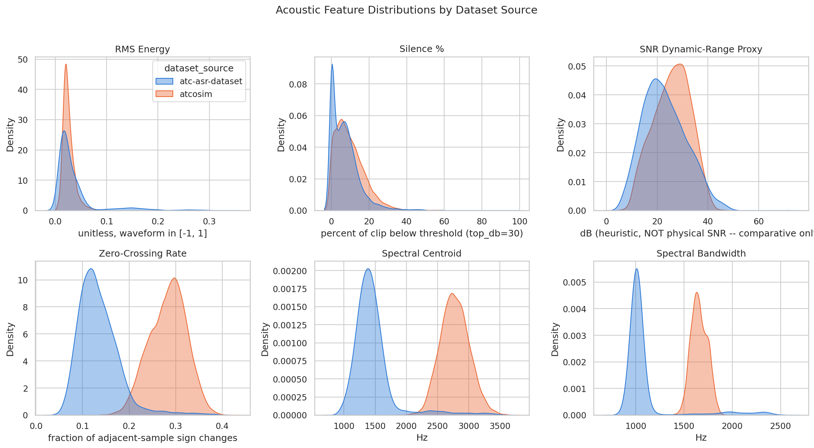

Six acoustic features (RMS energy, silence percentage, an SNR dynamic-range proxy, zero-crossing rate, spectral centroid, spectral bandwidth; formulas, units, and assumptions documented in `preprocessing/audio_features.py`) were computed per utterance directly from the decoded waveform, inline in the same pass that derives `duration_sec`, so no clip is decoded twice.

**Finding: real ATC audio (ATC-ASR-Dataset) occupies a measurably narrower-bandwidth region of acoustic feature space than simulated ATCOSIM audio.** Mean spectral centroid is 1,460 Hz for ATC-ASR-Dataset vs. 2,777 Hz for ATCOSIM; spectral bandwidth is 1,087 Hz vs. 1,657 Hz; zero-crossing rate is 0.135 vs. 0.283: all three consistently lower for the real-audio source. This lines up with how each corpus was produced: real ATC audio is transmitted over a narrowband VHF radio channel (traditionally ~300-3,400 Hz voice bandwidth), which filters out exactly the higher-frequency content these three features measure, while ATCOSIM's recordings are captured full-bandwidth in a studio/lab setting with no radio-channel effect. ATC-ASR-Dataset also shows higher RMS-energy variance (std 0.045 vs. 0.011), consistent with uncontrolled real-world recording conditions (variable mic gain/distance, radio squelch) that a simulated corpus wouldn't have.

**Modeling implication:** a model trained predominantly on ATCOSIM's clean, full-bandwidth audio is learning a measurably different acoustic distribution than it will encounter in real deployment; this is the kind of domain gap the real-vs-simulated comparison is designed to surface before training begins.

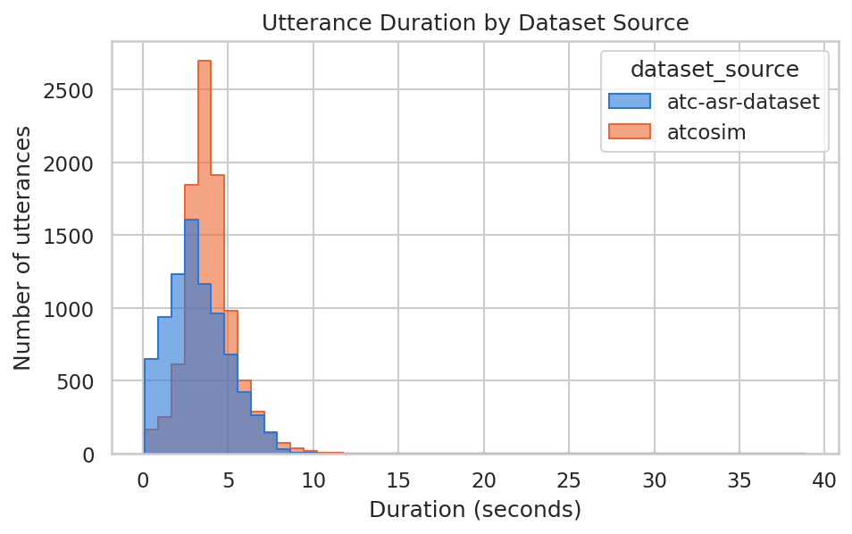

ATCOSIM clips run slightly longer on average (3.94s vs. 3.28s) with a much heavier tail: its maximum (38.9s) is over 2x ATC-ASR-Dataset's (15.3s). This outlier turned out to be an off-domain personal conversation captured during a simulation session and not ATC phraseology at all (see 4.4). Both distributions are unimodal and right-skewed which is expected for short spoken utterances.

## 4.3 Transcript Feature Analysis

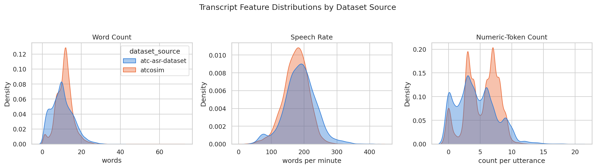

**Finding: ATCOSIM utterances are slightly longer by word count but draw from a much smaller, more repetitive vocabulary.** ATCOSIM averages 11.3 words/utterance vs. 10.2 for ATC-ASR-Dataset, but ATC-ASR-Dataset has a far richer vocabulary: 1,167 distinct word types vs. 830 for ATCOSIM, a type-token ratio of 0.0141 vs. 0.0077 (nearly double), despite ATCOSIM having more total word tokens overall (107,913 vs. 82,764, from its larger row count). This is the same pattern found in the repeated-transcript analysis (4.1): real-world ATC traffic is lexically more varied than scripted simulation exercises, even under standardized phraseology conventions.

ATC-ASR-Dataset also shows a *higher* mean speech rate (187.7 vs. 174.4 WPM) despite shorter average clips, plausibly real operational time pressure (controllers packing information tightly) vs. more deliberately-paced simulated training speech. Both distributions have a long right tail of very-high-WPM outliers, which turned out to be a known artifact of the WPM formula on very short clips rather than genuinely fast speech (4.4).

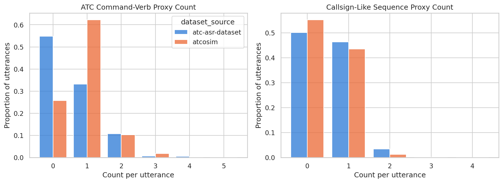

ATCOSIM has a much higher command-verb detection rate (only 25.7% of its rows have zero detected command verbs, vs. 54.8% for ATC-ASR-Dataset), which is again consistent with ATCOSIM's scripted scenarios emphasizing standard instruction phraseology more systematically, while real traffic includes more short acknowledgements and readbacks with no command verb present. Callsign-like detection is more similar between sources (~50% vs. ~55% zero-detection); this proxy's fixed, non-exhaustive airline-word vocabulary is the likely limiting factor for both sources equally. Ideally the planned LLM-based extraction (Section 3.3) will close this gap once implemented.

## 4.4 Outliers

Three outlier patterns were investigated, each with an explicit retain/remove decision rather than a blanket rule:

- **The long (38.9 seconds) ATCOSIM outlier** is a correctly-transcribed audio of an off-domain personal conversation ("...have a nice evening, thank you bye bye ciao... the irish pub...") and not operational ATC phraseology. Thus, the decision was to retain it in the EDA corpus since it's legitimate data. However, this record was flagged as a candidate to exclude specifically from ASR training/eval splits since it isn't representative of the task the model is meant to learn.
- **Extreme speech-rate outliers (400+ WPM)** all come from 1-2 word, sub-second clips: a mathematical artifact of `speech_rate_wpm = word_count / (duration_sec / 60)` on very small denominators (e.g., this is not actually fast speech). The decision was to retain the rows but treat `speech_rate_wpm` as unreliable below ~1 second of audio in any downstream use.
- **Very short single-word utterances** (~0.14-0.28s: "yeah", "roger", "okay") are valid and expected ATC acknowledgements. For example, one transcript, `"roge"`, is very likely a publisher-side transcription typo for "roger" which is present in ATCOSIM's original data and verified that it was not introduced by the data ingest pipeline.

## 4.5 Class Imbalance and Split Composition

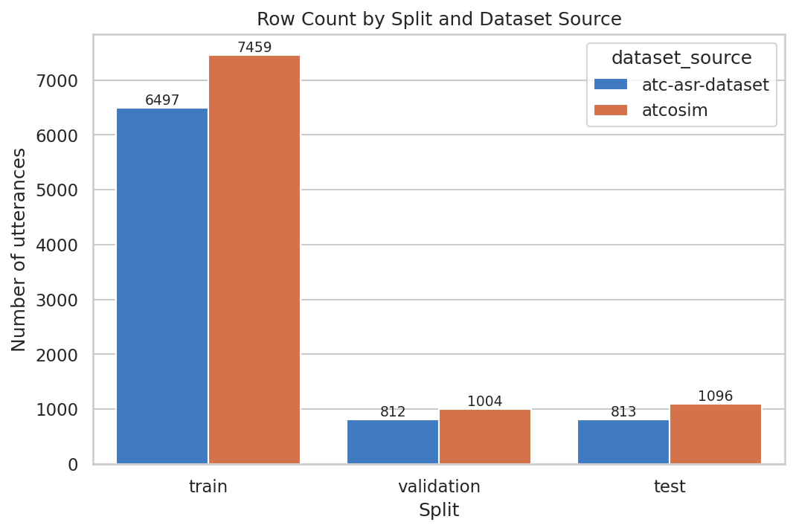

The two sources are reasonably balanced within every split (ATC-ASR-Dataset is 42.6-46.6% of each split's rows, ATCOSIM the remainder), so no split is dominated so heavily by one source that a model could ignore the other. The goal was an 80/10/10 train/validation/test split and the resulting split proportions are 78.9%/10.3%/10.8% train/validation/test which land close to, but not exactly at the goal. ATC-ASR-Dataset is left at its own near-exact 80/10/10 published split, while ATCOSIM's session-grouped resplit (Section 3.5) overshoots slightly. This is because its ~50 recording sessions can't be divided into exactly-proportioned groups. This is a disclosed, intentional trade-off. Exact percentages were traded for a test set with zero same-session leakage.

## 4.6 Summary of Findings and Modeling Implications

Every analysis in this section converges on the same underlying signal, approached from four independent angles that all agree:

1. **Acoustics:** real audio has lower spectral centroid/bandwidth/zero-crossing rate (narrower, radio-filtered bandwidth) and higher RMS-energy variance (e.g., due to uncontrolled recording conditions) compared to simulated audio.
2. **Vocabulary:** real audio has nearly 2x the type-token ratio of simulated audio.
3. **Phraseology structure:** simulated audio has a much higher rate of detected command verbs and repeated transcripts. Scripted scenarios seem to lean on a smaller, more standardized set of instructions.
4. **Speech rate:** real audio is spoken faster on average despite shorter clips.

**Central modeling implication:** a model trained predominantly on ATCOSIM will see a narrower acoustic distribution and less varied vocabulary than it will encounter in real deployment. Any evaluation strategy should report performance on the real-audio (ATC-ASR-Dataset) test split separately from simulated-audio performance. Aggregating them would hide the domain gap. Two concrete, actionable follow-ups also came out of this analysis which are to exclude the identified off-domain outlier (section 4.4) from training/eval splits, and treat `speech_rate_wpm` as unreliable below ~1 second of audio wherever it's used as a feature.

---

# 5. Machine Learning

This section covers the project's modeling work in two layers. Sections 5.1-5.7 describe the ASR prototype (Research Question 1, Section 2.3) built on a 100-utterance evaluation subset and a 1,000-row fine-tune. Sections 5.8-5.11 report the production results of the standalone pipelines: full-dataset ASR training scored on all 1,909 test utterances (5.8, including entity-level accuracy and Research Question 3), LLM-assisted aviation information extraction and student NER models (5.9-5.10, Research Question 2), and CPU inference benchmarks (5.11). Section 5.12 summarizes results, limitations and next steps. The full analysis is in [notebooks/machine_learning.ipynb](../notebooks/machine_learning.ipynb), which executes cleanly end to end (Sections A-E prototype; F-H load saved production results); where the two layers disagree, the production results supersede the prototype figures.

## 5.1 Modeling Infrastructure

Reusable infrastructure was built so that data curation, model training, evaluation and deployment don't require running a notebook end to end:

- **`scripts/run_ingest.py`**: a standalone CLI wrapper around `DataIngestPipeline` (the same pipeline documented in Section 3.5), with `--force` (recompute from scratch), `--num-proc` (parallelize feature derivation), `--purge-raw` (delete each source's raw Hugging Face download cache once `data/processed/` exists, to reclaim disk space), `--purge-only`, and `--log-level`. This avoids the EDA notebook's much larger memory footprint (plots, audio-playback widgets, word clouds all sharing one kernel with the pipeline's own data), which matters on machines with limited RAM.
- **`run-pipeline.sh`**: an interactive driver script that orchestrates every stage of the pipeline (data ingest, NER annotation, curation and training, ASR training, and model download/upload). It asks, per stage, whether to run it and what arguments to pass.
- **Standalone ASR and NER pipelines** (`scripts/run_asr_train.py`, `run_ner_annotate.py`, `run_ner_curate.py`, `run_ner_train.py`; shared code in `src/asr/` and `src/ner/`): resumable, chunked runs with progress files and a monitoring dashboard, covered by CPU-only tests (54 passing).
- **Benchmarking and model store** (`scripts/benchmark_inference.py`, `scripts/model_store.py`, `upload-models.sh`, `download-models.sh`): latency/WER benchmarks (5.11) and a versioned S3 model store with a `latest/` tag that inference always targets.

As a practical side effect, this infrastructure was validated across two different development machines: the ASR prototype below was run end to end on both an RTX 3070 Ti Laptop GPU (8.6 GB VRAM) and, independently, an RTX 1000 Ada Generation Laptop GPU (6.4 GB VRAM), reproducing the same baseline and domain-adapted-comparison results on both (see the non-determinism caveat in 5.4 for the one piece that doesn't reproduce exactly).

## 5.2 ASR Experimental Design

**Evaluation subset.** The primary evaluation set is this project's own held-out `test` split from `DataIngestPipeline` (1,909 rows: 1,096 ATCOSIM + 813 ATC-ASR-Dataset; Section 3.5). A stratified 100-utterance sub-sample (43 ATC-ASR-Dataset / 57 ATCOSIM, proportional to each source's share of the pool) is drawn for fast iteration, via a configurable sample-size knob that scales to the full test set with no other code changes. The one documented off-domain outlier (the 38.9-second ATCOSIM personal-conversation clip; Section 4.4) is excluded from this pool before sampling, since it isn't representative of the task an ASR model is meant to learn.

**Leakage prevention** is inherited entirely from `DataIngestPipeline` (Section 3.5): ATCOSIM's session-grouped resplit and ATC-ASR-Dataset's preserved publisher split. No additional resplitting happens in the ASR prototype itself.

**Scoring normalization.** Whisper decodes numbers as digits (e.g., "6000"), while both corpora spell every number out as individual spoken digit words per ATC convention (e.g., "six zero zero zero"). Left unhandled, this digit/word-format mismatch would dominate Word Error Rate (WER) with scoring artifacts rather than real recognition errors, so a digit-to-spoken-word expander is applied to both reference and hypothesis text before scoring only (raw model output is preserved separately). This rule-based approach has a known gap: it doesn't handle callsign-specific expansions or reconcile "nine" vs. the ATC-standard "niner" (see 5.5).

**Three ASR conditions, evaluated on the same fixed test records:**

1. **Baseline**: `openai/whisper-medium.en` (769M parameters), a generic, English-only Whisper checkpoint with no ATC-specific training. Establishes a zero-shot reference point.
2. **Comparison**: `jacktol/whisper-medium.en-fine-tuned-for-ATC`, a Whisper medium.en checkpoint already fine-tuned on `jacktol/ATC-ASR-Dataset` — the same underlying corpus behind this project's `atc-asr-dataset` source. **Disclosed limitation:** the published dataset's split sizes match almost exactly what this project's pipeline independently preserves for that source, but there is no public confirmation that the fine-tuning run actually respected that split boundary. Any `atc-asr-dataset`-subset result for this model should be read as carrying an unverified train/test-overlap risk, not a clean held-out result.
3. **Project fine-tune**: `openai/whisper-small.en` (244M parameters), fine-tuned by this project on its own train split (Section 5.4). Unlike the comparison model, this condition has no leakage risk against the `atc-asr-dataset` test split, since the whole corpus was built leakage-safe from the start (Section 3.5).

## 5.3 Baseline and Domain-Adapted Comparison Results

| Model | Real audio WER (ATC-ASR-Dataset) | Real audio CER | Simulated audio WER (ATCOSIM) | Simulated audio CER |
| --- | --- | --- | --- | --- |
| Baseline (`whisper-medium.en`) | 161.9% | 120.0% | 21.9% | 11.8% |
| Comparison (`jacktol`, domain-adapted) | 9.2% | 3.8% | 12.9% | 7.6% |

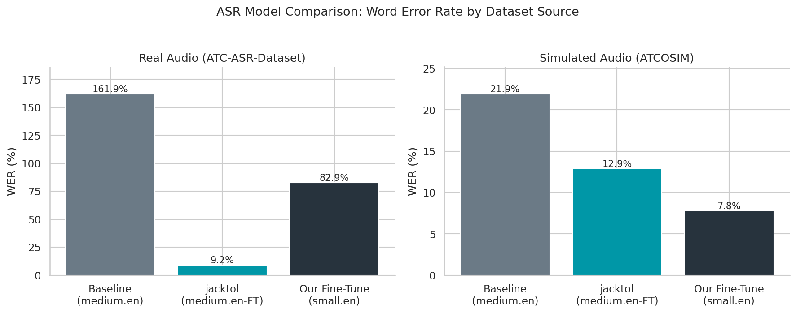

As expected from Section 4's acoustic domain-gap finding, the baseline's WER is far worse on real audio than on simulated audio. The domain-adapted comparison model closes most of that gap, though its real-audio number carries the leakage caveat from 5.2. The baseline's 161.9% aggregate (a WER over 100% means its output has more total edit operations than the reference has words, driven by runaway outputs — see 5.5) is a useful early signal in itself: a generic, non-domain-adapted model is not simply "worse" at ATC audio, it can fail catastrophically on it.

## 5.4 Fine-Tuning a Project-Specific Model

**Target model**: `openai/whisper-small.en` rather than medium.en. Full fine-tuning keeps fp32 master weights (for `fp16=True` mixed-precision training) plus Adam's two fp32 moment buffers plus fp32 gradients; for medium.en (769M parameters) that's roughly 4 × 769M × 4 bytes ≈ 12.3 GB just for weights, gradients, and optimizer state, before any activations — more than an 8GB laptop GPU has available. `whisper-small.en` (244M parameters) needs roughly a quarter of that and fits comfortably.

**Training data**: a stratified 1,000-row sample of the ~13,956-row train split (466 ATC-ASR-Dataset / 534 ATCOSIM), trained for 3 epochs, with a 200-row stratified validation subset for per-epoch checkpoint selection (never the test split). This validates the full training setup (data preparation, a custom Whisper data collator, WER-based `compute_metrics`, checkpointing) end to end, with the same sample-size knob used for the evaluation subset making it straightforward to scale up to the full train split later.

**Hyperparameters**: learning rate 1e-5, `per_device_train_batch_size=4` with `gradient_accumulation_steps=8` (effective batch size 32), fp16 mixed precision, 3 epochs, best checkpoint selected by validation WER. **An engineering finding worth recording:** an initial attempt at `per_device_train_batch_size=8` pinned the GPU at 98% VRAM and caused severe memory-pressure slowdown (step time climbed from roughly 4.4 seconds to over 18 seconds as training progressed); halving the batch size while doubling gradient accumulation (same effective batch size, far less peak memory) fixed it completely.

**Results:**

| Model | Real audio WER | Real audio CER | Simulated audio WER | Simulated audio CER |
| --- | --- | --- | --- | --- |
| Project fine-tune (`whisper-small.en`) | ~83% | ~79% | ~8% | ~3% |

The project's fine-tune beat the medium.en baseline in both domains despite having a quarter of the parameters, after only 1,000 training examples and 3 epochs. It does **not** generalize to real audio anywhere near as well as jacktol's medium-sized, far-more-extensively-trained comparison model (~83% vs. 9.2% WER) — expected, given the gap in both model size and training data volume. It does edge out jacktol's model on ATCOSIM (~8% vs. 12.9%), but this is not an apples-to-apples comparison: jacktol's model never saw ATCOSIM during its own training, while this project's fine-tuning subset deliberately included it.

**Note on reproducibility:** this project's own fine-tuned model's exact figures vary by a few tenths of a percentage point each time it is retrained, even with fixed seeds, due to ordinary GPU training non-determinism (confirmed by independently reproducing this fine-tuning run on two different GPUs, per 5.1). The baseline and comparison model figures above come from fixed, already-trained checkpoints doing pure inference and reproduce exactly, run to run.

## 5.5 Error Analysis and Failure Modes

Word-level alignment (substitutions, deletions, insertions) on the worst-scoring utterances from each model surfaced a small taxonomy of recurring failure modes:

| Category | Description | Representative example |
| --- | --- | --- |
| Repetition-loop hallucination | Whisper's decoder gets stuck repeating a short phrase dozens or hundreds of times on short, low-information, or noisy audio. A known, documented Whisper failure mode (Radford et al., 2022) that **persists even after fine-tuning** — this project's own fine-tune exhibits it too, just on a different utterance than the baseline. | Baseline: `atc-asr-dataset-test-000294` ("good morning" × ~150); project fine-tune: `atc-asr-dataset-test-000445` ("flight" × ~216) |
| Fabricated/unrelated hallucination | On sufficiently degraded real audio, the model produces a fluent, plausible-sounding sentence with **no relationship to the actual utterance** — not a misrecognition of what was said, but a fabrication. Verified by directly listening to the source audio and confirming the ground-truth reference is correct. | `atc-asr-dataset-test-000659` (duration 3.75s): reference "CSA TWO EIGHT SEVEN PRAHA RADAR RADAR CONTACT DESCEND FLIGHT LEVEL ONE ZERO ZERO"; baseline output "If you have any questions, please contact the flight control team at 1-800-566-7200." |
| Numeral substitution / "nine" vs. "niner" | The scoring normalizer (5.2) always expands a digit to "nine," so a reference using the ATC-standard "niner" mismatches an otherwise-correct hypothesis "nine." | Comparison model: reference "niner" → hypothesis "nine" |
| Callsign misrecognition | An airline/place-name word substituted for a similar-sounding wrong one, or — more often for the smaller fine-tuned model — a phonetic-alphabet callsign garbled into unrelated-sounding words entirely. | Baseline: "algerie" → "jerry"; project fine-tune: "eight juliett echo" → "athria degol" |
| Short-word / sign-off deletion | A trailing acknowledgement or sign-off word dropped entirely. | Comparison model: "tschuss" deleted |
| Homophone confusion | A word substituted for one that sounds identical or near-identical but changes meaning or spelling. | Baseline: "rhein" → "rhine"; "four" → "for" |

The two hallucination categories are both documented Whisper phenomena rather than bugs specific to this project's pipeline (Radford et al., 2022; see also the practitioner write-up on the repetition-loop pattern at https://metawhisp.com/blog/whisper-repeating-word-loop-fix/). Because fine-tuning did not eliminate the repetition-loop pattern, future work will need a generation-time mitigation (e.g., a repetition penalty or `no_repeat_ngram_size` on `.generate()`, or post-hoc output filtering) rather than relying on more training data alone.

**A methodological finding that follows directly from these outliers:** a single runaway output can dominate a corpus-level WER average. The baseline's 161.9% aggregate real-audio WER (5.3) reflects a *median* per-utterance WER of only 55.6% once the hallucinated outliers are set aside — still clearly worse than its simulated-audio performance, but far less extreme than the aggregate implies. The project's own fine-tune shows the identical pattern (82.9% aggregate vs. a 33.3% median). This is a caution against reading a single aggregate WER number in isolation, and the reason this project reports a per-utterance error taxonomy alongside it rather than instead of it.

## 5.6 Aviation-Specific Evaluation

As noted in Section 2.2, word-level WER treats every token equally, but a missed callsign or altitude digit matters far more operationally than a missed filler word. Since neither corpus provides ground-truth entity-span labels (Section 3.3), aviation-specific accuracy was measured with proxy metrics: the fraction of reference tokens belonging to a given vocabulary (ICAO phonetic alphabet + known airline words for callsigns; ATC numeral words; ATC command verbs — the same vocabularies introduced in Section 4.3) that also appear in the model's hypothesis, plus new best-effort presence-only regex detectors for altitude, heading, runway, and frequency phraseology (none of which exist in the Section 4 proxy vocabulary).

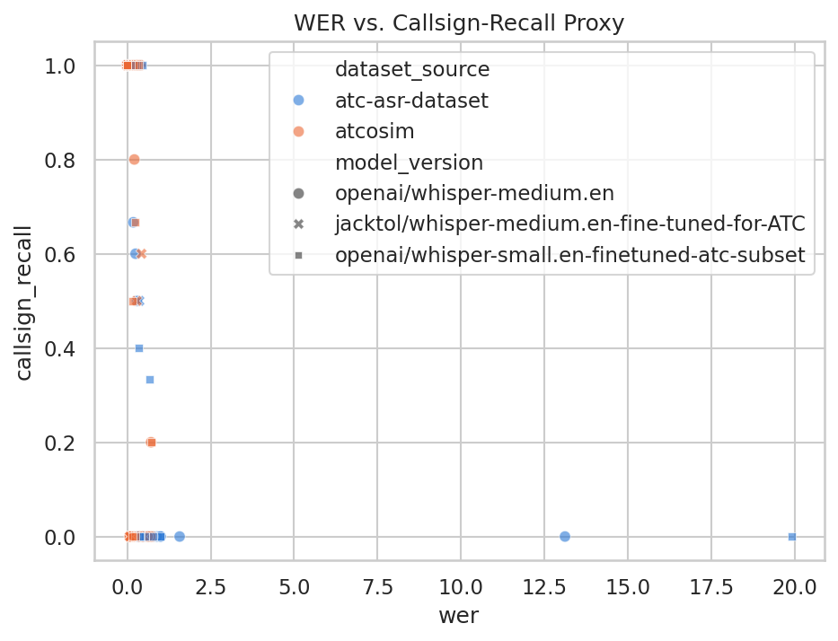

**The domain gap is sharper in callsign recognition than aggregate WER alone suggests.** The baseline's callsign-recall proxy collapses from 67.9% on simulated audio to just 10.4% on real audio — a much steeper drop than the aggregate WER figures (21.9% → 161.9%) imply. The domain-adapted comparison model holds callsign recognition far more evenly across sources (86.1% simulated vs. 97.1% real, with the real-audio figure still carrying the leakage caveat from 5.2). The project's own fine-tune lands in between the two (~85% simulated vs. ~57% real), consistent with having trained on far less data than the comparison model.

Correlating per-utterance WER against these proxy recall metrics gives only a moderate, mostly negative relationship — for example, the baseline's corr(WER, callsign_recall) = -0.25, corr(WER, numeric_recall) = -0.46, corr(WER, command_recall) = -0.40; the comparison model's corr(WER, callsign_recall) = -0.45; the project's fine-tune's corr(WER, callsign_recall) ≈ -0.33, corr(WER, numeric_recall) ≈ -0.49, and corr(WER, command_recall) ≈ -0.03 (essentially no relationship). That last figure is a concrete illustration of this section's opening point: the fine-tune's overall WER barely moves with whether a command verb survives, so an evaluation that only tracked aggregate WER could easily miss that its command recognition is meaningfully weaker than its WER alone would suggest. This directly supports the project's founding premise (Section 2.2) that WER alone is not a sufficient evaluation measure for ATC-specific ASR.

## 5.7 Communication Characteristics and Model Performance (Research Question 3)

Per-utterance WER (all three models) was joined back to `utterance_df`'s acoustic and linguistic features — duration, speech rate (masked below ~1 second per the artifact documented in Section 4.4), the SNR dynamic-range proxy, and numeric-token density — to begin investigating which characteristics are associated with transcription error.

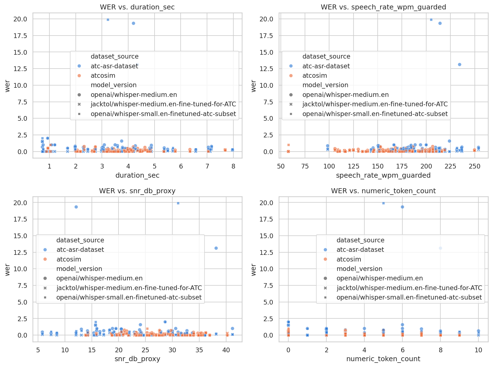

This join is exploratory at this stage: the error analysis in 5.5 already identifies *acoustic degradation* as a trigger for the fabricated-hallucination failure mode specifically (the one concrete example found had unusually poor audio quality for its duration), which is consistent with Research Question 3's premise that acoustic quality should relate to model failure. A fuller quantitative treatment of this relationship (e.g., formal correlation/regression against each characteristic, by model and by dataset source) is carried out on the full test set in 5.8.

## 5.8 Full-Dataset ASR Training and Evaluation

The prototype in 5.4 fine-tuned on 1,000 of the 13,956 training rows and was evaluated on a 100-utterance subset. The standalone pipeline (`scripts/run_asr_train.py`, `src/asr/`) removes both limits: every model below was trained on the full train split and scored once on the **full 1,909-utterance test split** (813 real-audio and 1,096 simulated-audio utterances). These results supersede the 100-utterance figures in 5.3-5.4, which remain as the record of the prototype.

### Design

**Data and leakage.** The splits are the leakage-safe splits from Section 3.5. Training uses all 13,956 train rows, per-epoch checkpoint selection uses a 500-row stratified validation sample, and the test split is scored once per model. Log-mel features are computed on the fly in the data-loader workers rather than precomputed (an 80x3000 float32 spectrogram is about 1 MB per clip, roughly 13 GB for the corpus).

**Three fine-tuning experiments** use identical data, scoring, and normalization (5.2):

1. **whisper-small.en, full fine-tune, 3 epochs**: the prototype setup scaled to the whole train split (learning rate 1e-5).
2. **whisper-small.en, up to 8 epochs** with early stopping (patience 2 epochs on validation WER; it never triggered, so all 8 epochs ran, and the best epoch by validation WER was 6): does training longer help?
3. **whisper-medium.en with LoRA adapters** (Hu et al., 2021): low-rank adapters (rank 32, alpha 64, dropout 0.05) on the attention and feed-forward projections, on a frozen fp16 base. This trains 34.6M of 798.5M parameters (4.3%), so a model that cannot be fully fine-tuned on an 8 GB GPU (5.4: about 12.3 GB for weights, gradients and optimizer state) fits easily. LoRA needs a much higher learning rate than full fine-tuning (5e-4 here versus 1e-5), the effective batch is 32 (2 x 16 accumulation), training runs 3 epochs, and the adapters are merged into a plain fp16 model afterwards for deployment.

**Comparison conditions** are zero-shot `whisper-small.en` and `whisper-medium.en` (no domain training) and the off-the-shelf `jacktol/whisper-medium.en-fine-tuned-for-ATC` model, all scored on the same full test split.

**Statistics.** Corpus WER is edit-distance weighted (not a mean of per-utterance WERs). Confidence intervals are 95% percentile bootstrap intervals over utterances (2,000 resamples). Comparisons between two models are *paired*: the same resampled utterances are used for both, so a difference is tested directly instead of by comparing two overlapping intervals.

**Engineering findings worth recording.**

- *LoRA batch size.* At a per-device batch of 4, medium.en + LoRA took 114 seconds per optimizer step as the driver spilled GPU memory into system RAM. A per-device batch of 2 with 16 accumulation steps (the same effective batch of 32) ran at 11 seconds per step with a 7.1 GB peak, a tenfold difference caused by memory pressure rather than computation. This is the same failure mode as the small-model finding in 5.4.
- *Resumable training.* Long runs resume from the newest checkpoint. The repository pins `torch` 2.5.1, whose restricted `torch.load` cannot read Trainer optimizer and RNG state under `transformers` 5, so the pipeline lifts that guard only while resuming from checkpoints that the same process wrote into its own output folder (verified by a CPU test that resumes training mid-run).
- *Resource guard.* The training CLI refuses to start while another job holds the GPU, since a collision would crash both.

### Results

| Model (full test split) | Overall WER (95% CI) | Real audio WER | Simulated audio WER | Train time | Best validation WER |
| --- | --- | --- | --- | --- | --- |
| `whisper-small.en`, zero-shot | 42.2% (39.9-44.6) | 61.3% (57.4-65.9) | 28.8% (26.6-31.6) | n/a | n/a |
| `whisper-medium.en`, zero-shot | 35.7% (33.7-37.9) | 53.6% (49.3-58.4) | 23.1% (22.1-24.2) | n/a | n/a |
| `jacktol` ATC `medium.en` (off the shelf) | 12.4% (11.8-13.0) | 9.1% (8.3-9.9) | 14.8% (13.9-15.6) | n/a | n/a |
| `small.en` fine-tuned, 3 epochs | 5.4% (4.9-5.9) | 10.9% (9.9-12.0) | 1.5% (1.1-1.9) | 57 min | 5.94% |
| `small.en` fine-tuned, 8 epochs | 4.9% (4.4-5.4) | 9.7% (8.8-10.7) | 1.4% (1.1-1.8) | 154 min | 5.16% |
| **`medium.en` + LoRA, 3 epochs (selected)** | **3.8% (3.4-4.3)** | **7.5% (6.7-8.4)** | **1.2% (0.9-1.6)** | 239 min | 4.26% |

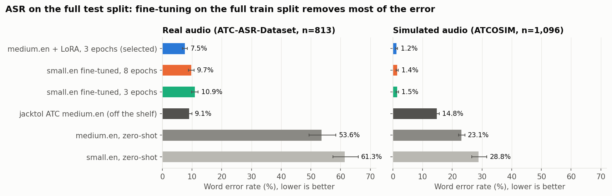

- **Fine-tuning on the full train split removes most of the error.** Zero-shot `medium.en` scores 35.7% overall and 53.6% on real audio; the selected model scores 3.8% and 7.5%.
- **On real audio, the hardest and most operationally relevant domain, the selected model is significantly better than the off-the-shelf ATC model:** 7.5% versus 9.1%, a paired difference of -1.5 points (95% CI -2.4 to -0.6). The 3-epoch small model is significantly *worse* than that model on real audio (+1.9 points, CI +0.8 to +2.8), and the 8-epoch small model is statistically indistinguishable from it (+0.7, CI -0.3 to +1.7). All three fine-tuned models are significantly better overall (by 7.0 to 8.6 points) because the off-the-shelf model is poor on simulated audio.
- **Training the small model longer helped only modestly:** 8 epochs improved real-audio WER from 10.9% to 9.7% for 2.7 times the training time, and simulated audio barely moved (1.5% to 1.4%).
- **Interpretation caveats.** Simulated audio is 57% of the test split, so overall WER flatters models that do well on it. The off-the-shelf model's real-audio number carries the unverified train/test-overlap risk from 5.2, and the project's models saw ATCOSIM in training while the off-the-shelf model never did (5.4), so the simulated-audio comparison is not a fair generalization test. Each model was trained once, so run-to-run training variance is not captured by these intervals (5.4 documents a few tenths of a point from GPU non-determinism).
- **Error profile of the selected model.** 78% of all test utterances are transcribed exactly right (59% of real-audio and 92% of simulated-audio utterances), and 29 of 1,909 utterances have WER above 50%. Only 3 exceed 100%: two have extra or substituted digits on very short clips ("inbound tusin" became "three five two seven") and one appends unrelated words; none is the repetition-loop hallucination that dominated the baseline's worst cases (5.5).

### Entity-Level Accuracy (Aviation-Specific Evaluation, Revisited)

Section 5.6 could only approximate aviation-specific accuracy with vocabulary proxies because neither corpus has entity labels. With the NER model from 5.9, entity accuracy can be measured directly: the selected spaCy model extracts entities from each reference transcript and from each model's transcript (both with the 5.2 scoring normalization), and an entity counts as recognized when the same label and the same text appear in both.

| Model | Entity F1 | Real audio | Simulated audio | CALLSIGN recall | COMMAND | ALTITUDE | FREQUENCY | WAYPOINT |
| --- | --- | --- | --- | --- | --- | --- | --- | --- |
| **`medium.en` + LoRA (selected)** | **0.935** | **0.856** | **0.985** | **0.886** | 0.972 | 0.964 | 0.937 | 0.928 |
| `small.en`, 8 epochs | 0.918 | 0.821 | 0.980 | 0.860 | 0.959 | 0.964 | 0.917 | 0.898 |
| `small.en`, 3 epochs | 0.908 | 0.798 | 0.978 | 0.847 | 0.954 | 0.953 | 0.917 | 0.882 |
| `jacktol` ATC `medium.en` | 0.754 | 0.787 | 0.733 | 0.557 | 0.952 | 0.926 | 0.737 | 0.252 |
| `medium.en`, zero-shot | 0.513 | 0.343 | 0.612 | 0.286 | 0.718 | 0.468 | 0.605 | 0.154 |
| `small.en`, zero-shot | 0.445 | 0.260 | 0.549 | 0.231 | 0.660 | 0.383 | 0.522 | 0.128 |

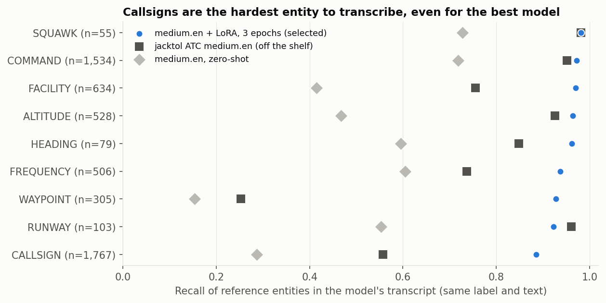

- **WER hides where the errors fall.** The selected model preserves 93.5% of the 5,511 reference entities, but **callsigns are its weakest entity (recall 0.886)** compared with 0.972 for commands and 0.964 for altitudes: airline names and spelled alphanumeric registrations are the hardest tokens, and a 7.5% real-audio WER does not reveal that.
- **Entity accuracy separates models more sharply than WER.** The off-the-shelf model's real-audio WER (9.1%) is close to the selected model's (7.5%), yet its overall entity F1 is 0.754 with callsign recall of 0.557 and waypoint recall of 0.252. This directly supports the project's premise (Section 2.2) that WER alone is not a sufficient evaluation for this domain.
- **Entity gains track WER gains.** CALLSIGN recall rises from 0.847 (small, 3 epochs) to 0.860 (8 epochs) to 0.886 (medium + LoRA); callsigns remain the weakest label for every fine-tuned model.
- **Caveats.** The reference entities are NER-derived rather than human-verified. The same model processes both sides, so its own errors largely cancel, but a systematic NER bias would not. Matching requires the identical label and text, which is strict for multi-word spans.

### Training Dynamics and the 8-Epoch Hypothesis

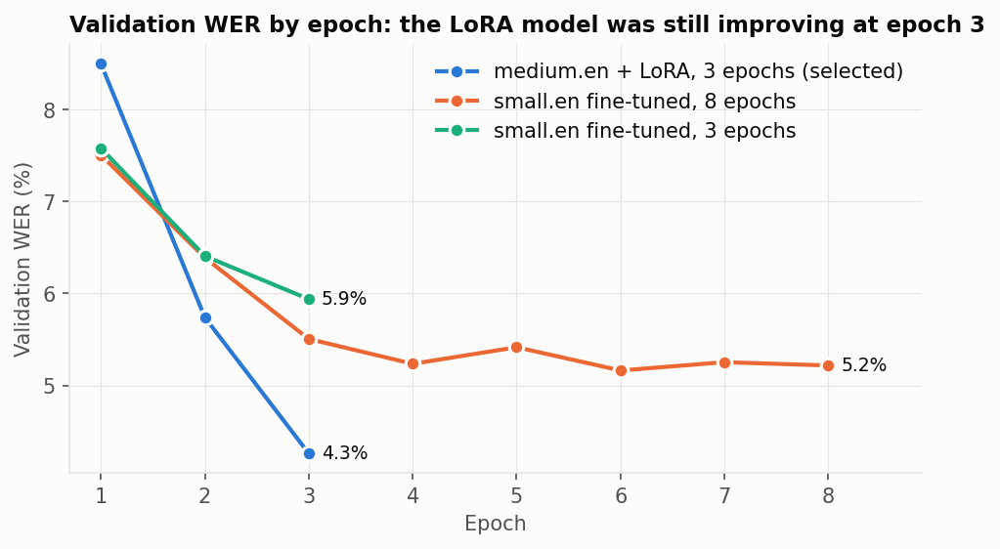

The small model's validation WER plateaus near 5.2% after epoch 4 to 6, while its validation *loss* is lowest at epoch 3 (0.127) and rises afterwards (0.142 at epoch 8): the usual signature of diminishing returns and mild overfitting. The LoRA model behaves differently. Its validation WER was still falling steeply at the last epoch (8.5%, 5.7%, 4.3% at epochs 1 to 3; loss 0.186, 0.122, 0.111).

**Future enhancement (hypothesis, not yet tested).** Training the LoRA model for about 8 epochs would plausibly yield additional gains, most likely on real audio. The caveats are that the small model's extra epochs showed diminishing returns, that the LoRA learning rate (5e-4) was a single untuned choice, and that the run would cost roughly 10 GPU-hours on the development GPU (239 minutes for 3 epochs). A learning-rate comparison and a higher LoRA rank are natural companions. The 3-epoch model is used for the prototype application.

### Communication Characteristics and WER (Research Question 3)

The prototype analysis (5.7) joined WER to utterance characteristics on 100 utterances. With the full-test results and entity counts from the LLM annotation run (5.9; matched by transcript text for 1,851 of 1,909 utterances), the question can be answered on all 1,909 utterances.

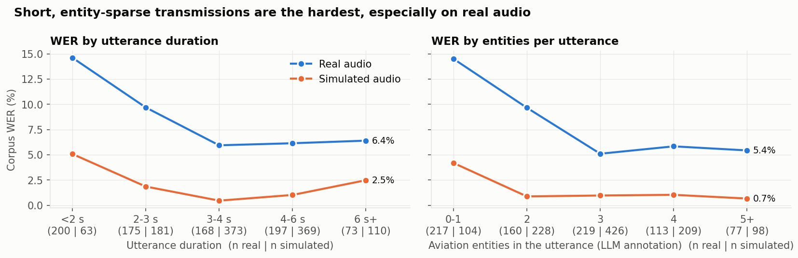

| Utterance duration | Real audio: n | WER | Simulated audio: n | WER |
| --- | --- | --- | --- | --- |
| under 2 s | 200 | 14.6% | 63 | 5.1% |
| 2-3 s | 175 | 9.7% | 181 | 1.8% |
| 3-4 s | 168 | 5.9% | 373 | 0.5% |
| 4-6 s | 197 | 6.1% | 369 | 1.0% |
| 6 s and longer | 73 | 6.4% | 110 | 2.5% |

| Spearman correlation of per-utterance WER with... (* = p < 0.01) | duration | speech rate | SNR proxy | numeric tokens | word count | entities |
| --- | --- | --- | --- | --- | --- | --- |
| Selected model, all audio | -0.07* | +0.08* | -0.17* | -0.14* | -0.02 | -0.13* |
| Selected model, real audio | -0.05 | +0.02 | -0.14* | -0.13* | -0.03 | -0.15* |
| Selected model, simulated audio | +0.05 | -0.05 | +0.05 | -0.10* | +0.02 | -0.01 |
| Zero-shot `medium.en`, real audio | -0.32* | +0.14* | -0.03 | -0.28* | -0.25* | -0.12* |

- **Very short transmissions are the hardest, concentrated on real audio:** real-audio WER is 14.6% under 2 s, 9.7% at 2-3 s, and about 6% beyond 3 s; simulated audio has the same shape at a much lower level.
- **Operationally dense transmissions are easier, not harder.** Real-audio WER is 14.5% for utterances with 0 or 1 entities and 5.1% to 5.8% for utterances with 3 or more. Entity count largely stands in for length and context: a longer, more structured transmission gives the model more to condition on.
- **Per-utterance correlations are weak.** For the selected model every Spearman |rho| is at most 0.17 (strongest: the SNR proxy, -0.17), and several reach p < 0.01 only because there are about 1,900 utterances. Fine-tuning weakened the dependence on length: for zero-shot `medium.en`, real-audio WER correlates with duration at rho = -0.32, for the selected model at -0.05. The remaining difficulty is concentrated in the shortest clips instead of being spread across the characteristics.
- **Caveats.** The SNR figure is a dynamic-range heuristic (Section 4), entity counts are LLM-derived (span F1 about 0.88 against human labels, 5.9), and the evidence is correlational.

## 5.9 Aviation Information Extraction: LLM-Assisted Labeling at Scale (Research Question 2)

Neither corpus has entity labels (Section 3.3), so the labels are produced in stages: an LLM *teacher* labels the whole corpus, humans verify small evaluation sets, and small *student* models (5.10) are trained on the curated labels. The pipeline is `scripts/run_ner_annotate.py`, then `scripts/run_ner_curate.py`, then `scripts/run_ner_train.py` (code in `src/ner/`). Nine labels are used: CALLSIGN, COMMAND, FACILITY, ALTITUDE, HEADING, FREQUENCY, WAYPOINT, RUNWAY and SQUAWK.

### Annotator Design

- **Model and serving.** Qwen3.5-9B (4-bit weights) served with vLLM on the 8 GB development GPU, partly offloaded to CPU memory. The 4B model fits on the GPU directly and was used for most prompt experiments.
- **Schema-guided decoding.** Output is constrained to a JSON schema, so every response parses. Spans are validated against the transcript, and an invalid response is retried with a message that names the specific violation.
- **Rule hints and post-processing.** Cheap rules suggest candidate spans in the prompt; a normalizer merges adjacent FACILITY spans and expands COMMAND phrases; a missed-verb check triggers a retry when a command verb has no span.
- **Annotation guidelines** (COMMAND, FACILITY and callsign rules) were settled with the project author on concrete ambiguous examples: for instance, generic verbs count as commands, a cleared phrase is one whole COMMAND span, and partial callsigns are labeled.
- **Annotator comparison (95-utterance expanded gold set, span F1; each row is one prompt variant, "+normalize +missed" adds the span normalizer and missed-verb check).** The 9B model is better than the 4B in every variant, by 0.11 to 0.16 F1 and 11 to 23 more exactly-right utterances, mostly through CALLSIGN (about 0.94 against 0.62-0.76); its best result is 0.909. Post-processing helps both models (0.827 to 0.909 for the 9B, v1 prompt), while prompt versions v2 and v3 and few-shot retrieval give no clear improvement over v1 for either model. The 9B costs about 8 minutes per variant against under a minute (partly CPU-offloaded on the 8 GB GPU). Raw results are in `res/ner_experiments/`.

| Variant | 4B F1 | 9B F1 | 4B exact | 9B exact | 4B FACILITY / 9B FACILITY | 4B CALLSIGN / 9B CALLSIGN | Time 4B / 9B |
|---|---|---|---|---|---|---|---|
| v1 prompt | 0.709 | 0.827 | 38/95 | 49/95 | 0.39 / 0.43 | 0.75 / 0.95 | 32 s / 361 s |
| v1 +normalize +missed | 0.802 | 0.909 | 47/95 | 64/95 | 0.82 / 0.83 | 0.76 / 0.95 | 35 s / 470 s |
| v2 prompt | 0.693 | 0.851 | 36/95 | 56/95 | 0.59 / 0.65 | 0.62 / 0.94 | 58 s / 487 s |
| v2 +normalize +missed | 0.751 | 0.900 | 41/95 | 64/95 | 0.77 / 0.83 | 0.63 / 0.94 | 58 s / 479 s |
| v2 +fewshot k=4 | 0.728 | 0.844 | 42/95 | 57/95 | 0.51 / 0.63 | 0.75 / 0.92 | 62 s / 513 s |
| v2 +normalize +missed +fewshot k=4 | 0.790 | 0.898 | 50/95 | 63/95 | 0.81 / 0.89 | 0.76 / 0.92 | 63 s / 518 s |
| v3 prompt | 0.722 | 0.842 | 42/95 | 54/95 | 0.58 / 0.67 | 0.70 / 0.93 | 63 s / 489 s |
| v3 +normalize +missed | 0.774 | 0.904 | 46/95 | 63/95 | 0.78 / 0.83 | 0.70 / 0.93 | 66 s / 490 s |

*Caveat: single run per variant on 95 utterances, so differences of a few points between prompt variants are within noise; the 4B-9B gap is consistent across all eight variants.*

### Human-Verified Evaluation Sets

Evaluating the teacher needs labels it did not produce. Each candidate utterance was labeled by two annotators, the 9B model and Claude (blind, from the transcript alone), and the project author adjudicated **only the disagreements**, with options A/B randomly assigned so the reviewer could not tell which annotator was which. Four label sets result:

| Set | Utterances | Trust | Use |
| --- | --- | --- | --- |
| gold | 41 | hand-labeled | original tuning set |
| gold_expanded | 95 | human-verified | tuning and few-shot retrieval |
| silver | 167 | two annotators, not human-reviewed | training only |
| held-out gold | 100 | random sample, 38 human-adjudicated and 62 agreed by both annotators; frozen, never tuned on | final evaluation |

- **The task is genuinely ambiguous.** The two annotators agree exactly on 132 of 221 utterances (60%) in round 1 and 62 of 100 (62%) in round 2, with span F1 of 0.874 and 0.870. Disagreements are mostly COMMAND boundaries and multi-word FACILITY spans.
- **Adjudication outcomes.** Round 1: Claude 16, the 9B model 8, edited 10. Round 2: Claude 23, edited 8, the 9B model 7. Across both rounds (72 contested utterances), Claude's labels were chosen 54% of the time, the 9B model's 21%, and in 25% neither was fully right. A small audit of agreed utterances (labels shown) changed 1 of 20.
- **Caveat.** The 62 held-out utterances on which both annotators agreed were not individually reviewed, so a shared error would inflate scores slightly.

### Production Run and Label Quality

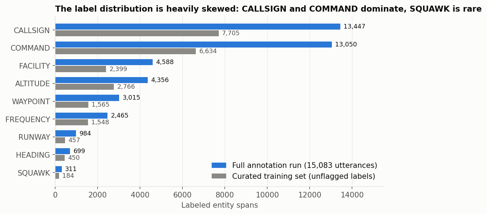

| Run statistic | Value |
| --- | --- |
| Utterances annotated | 15,083 (de-duplicated corpus) |
| Entity spans | 42,915 |
| Valid on completion | 99.5% |
| Needed at least one retry | 24.2% |
| Wall time | 12.5 h (3.03 s per utterance) on the 8 GB laptop GPU |
| Most frequent / rarest label | CALLSIGN 13,447 and COMMAND 13,050 / SQUAWK 311 |

The 12.5-hour run replaced an estimated 50 hours for the earlier Hugging Face prototype (about 70 times faster per utterance with vLLM and guided decoding, not counting the redesigned prompt).

| Production labels against human labels | Span F1 |
| --- | --- |
| Held-out gold (100, frozen; 67 utterances exactly right) | **0.878** (95% CI 0.838-0.915) |
| Gold expanded (95; also informed prompt and rule choices, so optimistic) | 0.907 (0.874-0.937) |
| Silver (167) | 0.944 |

Held-out per-label F1: RUNWAY 1.000, ALTITUDE 0.939, COMMAND 0.918, CALLSIGN 0.910, FACILITY 0.817, FREQUENCY 0.757 (recall 0.61: the model misses digit-only shorthand frequencies), WAYPOINT 0.735. HEADING and SQUAWK have 3 and 1 held-out spans, so their scores are not meaningful.

### Curation: Routing Doubtful Labels

The teacher's labels are not all trustworthy, so cheap signals flag doubtful ones: a retry was needed, a span was unresolved, no entity was found, a command cue had no span, or numbers were left unlabeled.

- **The signals work.** On the 195 human-verified utterances, the 38% that were flagged had at least one wrong label 61% of the time (45 of 74), against 16% (19 of 121) for the unflagged 62%.
- Across the corpus, 4,939 of 15,083 utterances (33%) are flagged. They are excluded from training and kept in a review queue.
- **Leakage guard.** 195 utterances whose text also occurs in a human-verified set were removed from training, so duplicated wording cannot inflate evaluation.
- **Curated set:** train 7,942, dev 898, LLM-labeled test 1,183, gold 95, held-out 100 (4,865 utterances flagged and dropped; 195 dropped as text leaks). The LLM-labeled dev/test splits measure agreement with the teacher on its *easy* cases, so the human-verified sets are the real measure of quality.

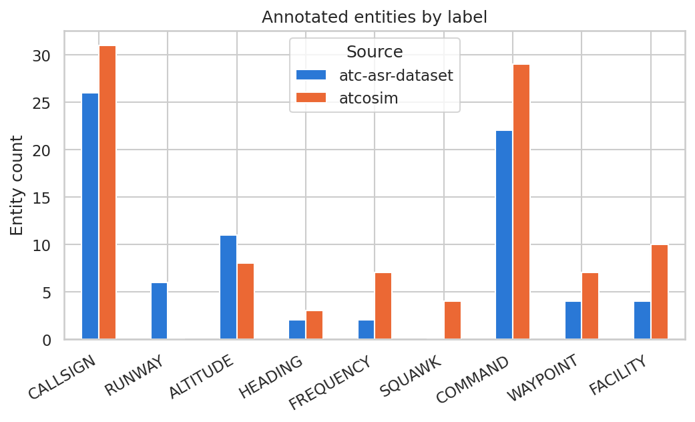

## 5.10 Student NER Models

The teacher takes about 3 seconds per utterance on a GPU, so it cannot run inside the application. Two small student models are trained on the curated labels and scored against the same human-verified sets: a spaCy blank pipeline (CNN tok2vec with a NER head) and a BERT token classifier. Each is trained twice, with and without **rare-label balancing** (oversampling utterances that contain SQUAWK, HEADING, RUNWAY and WAYPOINT spans). Scoring is exact-match span F1 (label and character offsets must match), with micro, per-label and macro averages and bootstrap confidence intervals over utterances.

| Model | Held-out F1 (n=100) | Gold F1 (n=95) |
| --- | --- | --- |
| Teacher (Qwen3.5-9B labels) | 0.878 (0.838-0.915) | 0.907 (0.874-0.937) |
| spaCy | 0.871 | 0.875 |
| **spaCy + rare-label balancing (selected)** | 0.861 | 0.891 |
| BERT | 0.874 | 0.883 |
| BERT + rare-label balancing | 0.866 | 0.881 |

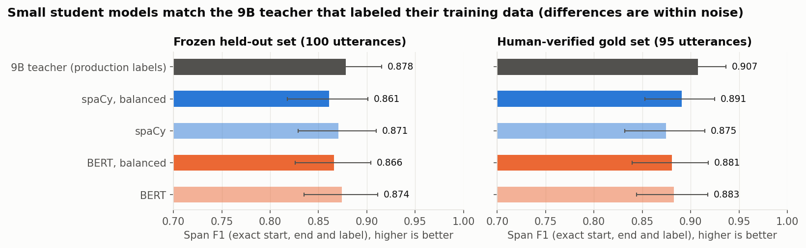

- **All four students match the teacher on human labels.** The paired bootstrap difference between spaCy-balanced and the teacher on the held-out set is -0.017 (95% CI -0.047 to +0.013), which includes zero. Students trained on the teacher's labels cannot be expected to exceed it, and they inherit its label noise, so the ceiling is about the teacher's accuracy.
- **BERT has no accuracy advantage over spaCy** (0.874 against 0.871 held-out F1, within noise) and needs a GPU for comparable speed (about 2,200 utterances/s against about 3,700 for spaCy on a CPU), so spaCy was selected. The model is about 4 MB and runs roughly four orders of magnitude faster than the teacher (about 0.3 utterances/s).
- **Balancing is suggestive, not conclusive.** On the human-verified gold set it improved per-label F1 for RUNWAY (+4.8 points), HEADING (+4.6), COMMAND (+3.2), FACILITY (+1.8) and WAYPOINT (+1.4), changed ALTITUDE and SQUAWK by 0, and lowered FREQUENCY (-2.5); macro-F1 rose from 0.875 to 0.890. The held-out set contains almost no rare-label spans (so its micro-F1 dipped slightly) and the per-label supports are small (10-96 spans), so these deltas are not statistically established. The balanced model was selected because it has the best gold-set macro-F1 of the spaCy variants, at no cost within the held-out confidence interval.

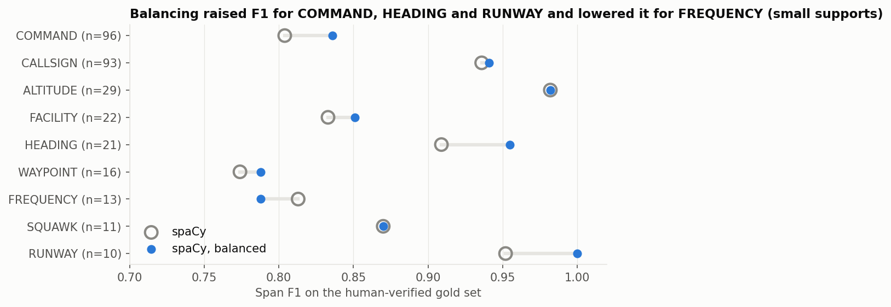

**Limitations.** Evaluation sets are small (95-100 utterances), exact-match scoring penalizes harmless boundary differences, and the held-out set was frozen only after the prompt and guidelines were settled, so some guideline choices inevitably reflect the gold set.

## 5.11 Inference Performance and CPU Deployment

The application must run on devices without a GPU, so latency is a design constraint, and a faster configuration is only acceptable if it is not less accurate. `scripts/benchmark_inference.py` times each configuration (model, backend, device, threads) in its own process at batch size 1 on the same utterances, recording latency, real-time factor (RTF; below 1 is faster than real time), memory and WER together. Test hardware: an Intel i9-12900H laptop (a high-end CPU, so slower devices will be slower in absolute terms) with an RTX 3070 Ti GPU under WSL2. Every experiment and decision is logged in `res/benchmarks/EXPERIMENTS.md`.

**Baseline (24 utterances; WER differences of a point or two are noise at this size).**

| Configuration (medium.en + LoRA) | Median latency | RTF | Peak RAM | WER |
| --- | --- | --- | --- | --- |
| GPU, PyTorch fp16 | 0.29 s | 0.10 | 2.3 GB | 6.3% |
| CPU, PyTorch fp32, 4 threads | 5.26 s | 1.64 | 5.1 GB | 6.3% |
| CPU, PyTorch dynamic int8 | 3.41 s | 1.07 | 7.7 GB | 6.7% |
| CPU, CTranslate2 int8 | 2.54 s | 0.81 | 2.2 GB | 8.0% |
| CPU, small.en, CTranslate2 int8 | 0.96 s | 0.30 | 1.4 GB | 8.0% |
| NER (spaCy) | 0.001 s | n/a | 0.9 GB | n/a |

More than 4 threads gave no gain on this hybrid-core CPU. NER takes about 1 ms, so latency is entirely ASR.

**Finding: the encoder wastes about 90% of its work.** Whisper always encodes a fixed 30 s window, but utterances average 3.8 s, and the encoder accounts for about 2.4 of the 2.5 s on the CPU. Encoding each clip in the smallest of 10/15/20/30 s windows that fits it ("dynamic windows") cuts CTranslate2 int8 latency from 2.54 s to **0.71 s** (3.6x) and the PyTorch backends by 2.3-2.7x. The model was fine-tuned on 30 s windows only, so accuracy had to be checked against the 30 s window on the same 300 clips:

| Encoder window | WER at 30 s | WER at this window |
| --- | --- | --- |
| 20 s | 4.53% | 4.66% |
| 15 s | 4.55% | 4.52% |
| **10 s** | **4.55%** | **4.55%** |
| 8 s | 4.51% | 8.18% |
| 6 s | 4.22% | 40.4% |
| 4 s | 5.60% | 237.9% |

Ten seconds is the floor without retraining; shorter windows collapse into hallucination.

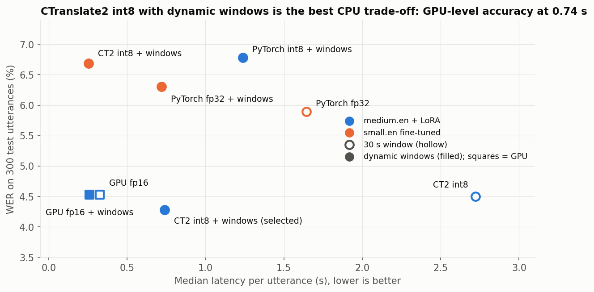

**Accuracy of the fast configurations (300 paired utterances, 150 real and 150 simulated).**

| Configuration | WER | Difference from GPU fp16 (95% CI) |
| --- | --- | --- |
| GPU fp16 reference | 4.53% | n/a |
| **CTranslate2 int8 + dynamic windows (CPU, 0.74 s median)** | **4.28%** | **-0.25 (-0.70, +0.22)** |
| PyTorch dynamic int8 + dynamic windows | 6.78% (13.1% real) | +2.25 (-0.13, +6.75), gross failures on real audio |
| small.en, CTranslate2 int8, dynamic windows | 6.69% (12.03% real) | +2.15 (+1.24, +3.12), worse |

- Neither CTranslate2 int8 nor dynamic windows measurably costs accuracy for the medium model; "no clear difference" rules out differences larger than about 0.7 points but is not proof of equality. The 8.0% against 6.3% in the baseline was noise.
- PyTorch dynamic int8 is both less accurate and needs about 3.5x the memory (7.7 GB against 2.2 GB), so it was rejected.
- The small model is a genuine trade of about 2 points of WER (about 4 on real audio) for 0.26 s latency.

**Decision.** On a CPU the application uses medium.en + LoRA through CTranslate2 int8 with dynamic windows on 4 threads: about **0.7 s per utterance (RTF about 0.2) in 2.2 GB**, roughly 7x faster than the PyTorch fp32 baseline, with accuracy indistinguishable from the GPU model (`best_transcriber()` in `src/asr/inference.py` chooses it). The converted model is 0.77 GB and published as its own artifact, so a CPU-only device needs neither PyTorch nor transformers; this was verified in a clean environment (median 0.82 s per clip, transcripts identical to the local model's).

**Model artifacts.** Models are published to a versioned S3 store (`s3://endurasoft-dev-ml-ops/ml-tasks/{asr,ner}/<model-name>/<run-id>/` with a `latest/` copy, sha256 manifests, and dry-run-by-default uploads). `./upload-models.sh` and `./download-models.sh --profile cpu|gpu` set up a new device, and inference always targets `latest/`. Published: the medium.en + LoRA ASR model (PyTorch and CTranslate2 int8) and the balanced spaCy NER model.

**Caveats.** One high-end laptop CPU was measured and thread-count rows are approximate on a hybrid CPU; model load takes 5-6 s, so the application must keep the model in memory; transcripts longer than 30 s need chunking.

## 5.12 Summary, Limitations, and Next Steps

**Research Question 1 (ASR).** The prototype (5.3-5.7) compared a generic baseline, a domain-adapted comparison model and a small project fine-tune on 100 utterances. The full-dataset experiments (5.8) trained on all 13,956 training rows and were scored on all 1,909 test utterances. The selected **whisper-medium.en + LoRA** model reaches **3.8% WER overall, 7.5% on real audio and 1.2% on simulated audio**, against 35.7% for the zero-shot model, and is significantly better on real audio than the off-the-shelf ATC model (9.1%; paired difference -1.5 points, 95% CI -2.4 to -0.6). It preserves 93.5% of aviation entities; callsigns are its weakest entity (recall 0.886).

**Research Question 2 (information extraction).** A Qwen3.5-9B annotator with schema-guided decoding, rule hints and normalization labeled all 15,083 utterances in 12.5 hours, reaching span F1 0.878 against a frozen human-verified held-out set (5.9). Routing signals isolated the doubtful third of the labels, and spaCy and BERT students trained on the rest match the teacher on human labels (5.10). The selected spaCy model with rare-label balancing is about 4 MB and runs at about 3,700 utterances per second on a CPU.

**Research Question 3 (characteristics and performance).** On the full test split, short transmissions are hardest (real-audio WER 14.6% under 2 s against about 6% beyond 3 s), entity-rich transmissions are easier, and per-utterance correlations are weak (|rho| at most 0.17) (5.8).

**Deployment.** On a CPU the ASR model runs at about 0.7 s per utterance (RTF about 0.2, 2.2 GB) through CTranslate2 int8 with dynamic encoder windows, with accuracy indistinguishable from the GPU model (5.11).

**Known limitations, disclosed rather than hidden:**

- The off-the-shelf comparison model's real-audio numbers carry an unverified train/test-overlap risk (5.2), and the project's models' simulated-audio numbers are not a fair generalization test against it for the mirror-image reason (ATCOSIM was in their training data but never in the comparison model's).
- Each model was trained once; run-to-run variation (a few tenths of a point, 5.4) is not in the confidence intervals.
- Entity-level ASR accuracy (5.8) uses NER-derived reference entities, which are not human-verified, and the NER evaluation sets are small (95-100 utterances) and partly agreed-by-annotators rather than individually reviewed.
- Students inherit the teacher's label noise, and 4,865 flagged utterances are unreviewed and excluded from training.
- The scoring normalizer does not reconcile "nine" with "niner" or decompose alphanumeric callsigns, and the "request" verb is not yet decided as a COMMAND.
- Latency was measured on one high-end laptop CPU.

**Next steps**, in order:

1. **Streamlit prototype application (ClearanceIQ)**, integrating the ASR and NER models (5.11) into the ATC audio analysis tool described in Section 2.1. Open design decisions: live against recorded input, voice-activity splitting of long recordings, entity colors and clearance-card layout, and raw against cleaned transcript display.
2. **Train the LoRA model for about 8 epochs (hypothesis, not yet tested).** The LoRA model's validation WER was still falling at epoch 3 (8.5%, 5.7%, 4.3%), unlike the small model, which plateaued by epochs 4-6 (validation loss rose after epoch 3). The small model's extra epochs gave only a marginal gain, the LoRA learning rate (5e-4) was a single untuned choice, and the run would cost about 10 GPU-hours (239 minutes for 3 epochs). A learning-rate comparison and a higher rank are natural companions.
3. **Human review of the 4,865 flagged NER utterances**, rare labels first, then retrain the students on the larger human-verified set.
4. **Fine-tune with 6-8 s encoder windows** so the floor drops below 10 s (the encoder would shrink a further 30-40%), and benchmark on the real target devices, including 2-thread configurations.

---

# References

ATCO2 Project. (n.d.). *ATCO2: Automatic collection and processing of voice data from air-traffic communications*. https://www.atco2.org/

Hofbauer, K., Petrik, S., & Hering, H. (2008). The ATCOSIM corpus of non-prompted clean air traffic control speech. In *Proceedings of the Sixth International Conference on Language Resources and Evaluation (LREC'08)*. European Language Resources Association.

jacktol. (n.d.). *ATC-ASR-Dataset* [Data set]. Hugging Face. https://huggingface.co/datasets/jacktol/ATC-ASR-Dataset

jacktol. (n.d.). *whisper-medium.en-fine-tuned-for-ATC* [Model]. Hugging Face. https://huggingface.co/jacktol/whisper-medium.en-fine-tuned-for-ATC

Hu, E. J., Shen, Y., Wallis, P., Allen-Zhu, Z., Li, Y., Wang, S., Wang, L., & Chen, W. (2021). *LoRA: Low-rank adaptation of large language models* (arXiv:2106.09685). arXiv. https://arxiv.org/abs/2106.09685

Klein, G., Hernandez, F., Nguyen, V., & Senellart, J. (2020). The OpenNMT neural machine translation toolkit: 2020 edition. In *Proceedings of the 14th Conference of the Association for Machine Translation in the Americas (AMTA 2020)*. (CTranslate2.)

Kwon, W., Li, Z., Zhuang, S., Sheng, Y., Zheng, L., Yu, C. H., Gonzalez, J. E., Zhang, H., & Stoica, I. (2023). Efficient memory management for large language model serving with PagedAttention. In *Proceedings of the 29th ACM Symposium on Operating Systems Principles*. (vLLM.)

Honnibal, M., Montani, I., Van Landeghem, S., & Boyd, A. (2020). *spaCy: Industrial-strength natural language processing in Python* [Computer software]. https://spacy.io/

Mangrulkar, S., Gugger, S., Debut, L., Belkada, Y., Paul, S., & Bossan, B. (2022). *PEFT: State-of-the-art parameter-efficient fine-tuning methods* [Computer software]. https://github.com/huggingface/peft

Jitsi. (n.d.). *jiwer: Evaluate your speech-to-text transcriptions* [Computer software]. GitHub. https://github.com/jitsi/jiwer

jlvdoorn. (n.d.). *atco2-asr* [Data set]. Hugging Face. https://huggingface.co/datasets/jlvdoorn/atco2-asr

jlvdoorn. (n.d.). *atcosim* [Data set]. Hugging Face. https://huggingface.co/datasets/jlvdoorn/atcosim

Lhoest, Q., Villanova del Moral, A., Jernite, Y., Thakur, A., von Platen, P., Patil, S., Chaumond, J., Drame, M., Plu, J., Tunstall, L., Davison, J., Šaško, M., Chhablani, G., Malik, B., Brandeis, S., Le Scao, T., Sanh, V., Xu, C., Patry, N., … Wolf, T. (2021). *Datasets: A community library for natural language processing* (arXiv:2109.02902). arXiv. https://arxiv.org/abs/2109.02902

McFee, B., Raffel, C., Liang, D., Ellis, D. P. W., McVicar, M., Battenberg, E., & Nieto, O. (2015). librosa: Audio and music signal analysis in Python. In K. Huff & J. Bergstra (Eds.), *Proceedings of the 14th Python in Science Conference* (pp. 18–24).

metawhisp. (n.d.). *Whisper repeating word loop fix*. https://metawhisp.com/blog/whisper-repeating-word-loop-fix/

Radford, A., Kim, J. W., Xu, T., Brockman, G., McLeavey, C., & Sutskever, I. (2022). *Robust speech recognition via large-scale weak supervision* (arXiv:2212.04356). arXiv. https://arxiv.org/abs/2212.04356

University of West Bohemia. (n.d.). *UWB ATC Corpus* [Data set]. LINDAT/CLARIAH-CZ Repository. https://lindat.mff.cuni.cz/repository/xmlui/handle/11858/00-097C-0000-0001-CCA1-0

Wolf, T., Debut, L., Sanh, V., Chaumond, J., Delangue, C., Moi, A., Cistac, P., Rault, T., Louf, R., Funtowicz, M., Davison, J., Shleifer, S., von Platen, P., Ma, C., Jernite, Y., Plu, J., Xu, C., Le Scao, T., Gugger, S., … Rush, A. M. (2020). Transformers: State-of-the-art natural language processing. In *Proceedings of the 2020 Conference on Empirical Methods in Natural Language Processing: System Demonstrations* (pp. 38–45). Association for Computational Linguistics.
